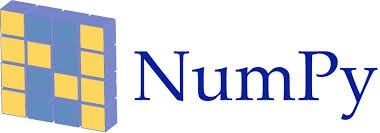
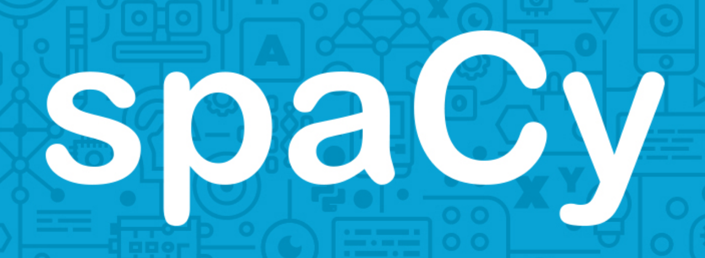
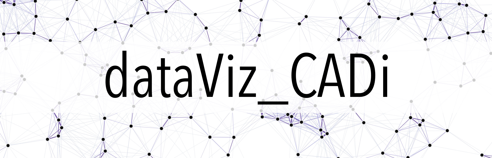

# dataPy CADi

This repository contains the materials for the **Data acquisition, wrangling and exploratory analysis in Python**, three days intensive [CADi](http://sitios.itesm.mx/va/capacitacion/1_2.html) (["Cursos de Actualización en las Disciplinas"](http://sitios.itesm.mx/va/capacitacion/1_2.html)) for faculty members at ["Tecnológico de Monterrey"](https://tec.mx/es) Institute.

The course covers subjects include the parsing and handling of data from different social sources, as well as the use of current frameworks for data-driven analyses. 

For other data-analysis related topics please take a look at the [dataViz_CADi](https://github.com/Chipdelmal/dataViz_CADi) repository. Which contains exercises on data visualization in [R](https://www.r-project.org/), [Python](https://www.python.org/) and [Mathematica](https://www.wolfram.com/mathematica/).

 

## Contents

This workshop was created with flexibility in mind. As such, modules are fairly independent and can be followed in a different order than the one suggested here. For a topic-oriented breakdown of the contents, please have a look at the [sitemap](./md/sitemap.md).

### Day 01 (8h)

1. [Introduction](./md/introduction.md): Objectives, scope, requirements and expectations.
1. [Data Primer](./md/dataPrimer.md): What is data science and how does data wrangling fit into it?
1. [Python 101](./md/python.md): Introduction to the programming language: [description](./md/python.md), [core types](./md/python101.md), [collections (data structures)](./md/python101b.md) and [functions](./md/python101c.md).
1. [Python Environments](./md/environments.md): Using [anaconda](./md/anaconda.md) and [virtualenv](./md/virtualenv.md) for development.
1. [IDE's](./md/ides.md): Using [Jupyter](https://jupyter.org/), [Spyder](https://www.spyder-ide.org/), [nteract](https://nteract.io/), and [Atom](https://ide.atom.io/) to write and launch our code.

### Day 02 (8h)

1. [A Story to Tell](./md/aStoryToTell.md): Data-driven storytelling.
1. [Git](./md/github.md): Version control using [github](https://github.com/) for code development, sharing and collaboration.
1. [Data Wrangling (part 1)](./md/dataWrangling.md): Using [pandas](./pandas.md) and [matplotlib](./matplotlib.md).
1. [Twitter](./md/twitter.md): Interfacing with the API to get trends, tweets, tags, etcetera.
1. [Data Wrangling (part 2)](./md/dataWrangling.md): Using [scikit-learn](./md/scikitLearn.md) to parse, manipulate, and pre-analyze data.

<!--1. [Python 102](./md/python102.md): Object-oriented concepts.-->

### Day 03 (8h)

1. [Advanced Python](./md/python103.md): Advanced topics (code efficiency and scopes).
1. [Google Trends](./md/googleTrends.md): Retrieving trends from google searches.
1. [Pypi](./md/pypi.md): Installing, browsing, and handling python packages.
1. [Python pkg](./md/pypi.md): Creating and installing a custom python package.
1. [GeoData](./md/geoData.md): A couple of examples of how to work with geographic datasets.
1. [Plotting](./md/plots.md): Using [matplotlib](https://matplotlib.org/) and [seaborn](https://seaborn.pydata.org/) to generate meaningful data representations.

## Resources

### Tools and Packages

* [anaconda](https://www.anaconda.com/): DataScience/Package manager platform for python and R.
* [atom](https://atom.io/): Versatile IDE for R, Python, Markdown, Javascript, amongst others.
* [matplotlib](https://matplotlib.org/): Python's most popular package to plot data.
* [numpy](https://www.numpy.org/): Highly efficient array manipulation in Python.
* [pandas](https://pandas.pydata.org/): Popular dataframe manipulation in Python.
* [plotly](https://plot.ly/): A good alternative for interactive plots in Python (similar to [Shiny](https://shiny.rstudio.com/) in [R](https://www.r-project.org/)).
* [onlinegdb](https://www.onlinegdb.com/online_python_interpreter): Online Python interpreter (originally developed for C and C++).
* [repl.it](https://repl.it/languages/python3): Online Python IDE and interpreter (also supports many other languages).
* [scikit-learn](https://scikit-learn.org/stable/): Data analysis and machine learning platform for python.
* [sympy](https://www.sympy.org/en/index.html): Symbolic calculus in Python.

### Online

* [Anaconda documentation](https://docs.anaconda.com/): Documentation for the anaconda environments manager.
* [dataViz Book](https://serialmentor.com/dataviz/): Online book with data visualization examples and principles.
* [dataViz CADi](https://github.com/Chipdelmal/dataViz_CADi): "Data Visualization" CADi bootcamp taught in December of 2018 with code examples in [Python](https://www.python.org/), [R](https://www.r-project.org/) and [Mathematica](https://www.wolfram.com/mathematica/).
* [Git Carpentry Workshop](https://swcarpentry.github.io/git-novice-es/): A good git/github introduction for Spanish-speaking audiences (with lots of examples and explanations).
* [Python 3.7 documentation](https://docs.python.org/3.7/): Official python documentation with examples of use of the built-in functions.
* [Mists of Data](http://ric70x7.github.io/blog_archive.html): [Ricardo's Andrade](http://ric70x7.github.io/) personal blog devoted to data analysis in Python with code examples.
* [Numpy documentation](https://www.numpy.org/devdocs/): Examples of use and developer guides for the popular multidimensional array package.
* [Seaborn](https://seaborn.pydata.org/): Documentation for the seaborn statistical visualization package.
* [SciPy documentation](https://docs.scipy.org/doc/): Guides for the most popular package for scientific computing in python.
* [Virtualenv documentation](https://virtualenv.pypa.io/en/latest/): Tutorials and documentation for python's built-in environment manager.
* [Scrapy](https://scrapy.org/): Web-scrapper application for Python
* [BeautifulSoup](https://pypi.org/project/beautifulsoup4/): An approachable web scraper application.
* [Spacy](https://spacy.io/): Advanced natural language analysis library.
* [NLTK](https://www.nltk.org/): Natural language toolkit for python.
* [DataCamp](https://www.datacamp.com/): Online courses on data analysis.

### Books

* [Theodore Petrou (2017). Pandas Cookbook.](https://www.packtpub.com/big-data-and-business-intelligence/pandas-cookbook?utm_source=github&utm_medium=repository&utm_campaign=9781784393878)
* [Scott Chacon and Ben Straub (2019). Pro Git.](https://git-scm.com/book/en/v2)
* [McKinney, W. Python for Data Analysis - Data Wrangling with Pandas, Numpy and Python. (2018). ISBN-13: 1491957662](https://www.amazon.com/Python-Data-Analysis-Wrangling-IPython/dp/1491957662/ref=asc_df_1491957662/?tag=hyprod-20&linkCode=df0&hvadid=312140868236&hvpos=1o1&hvnetw=g&hvrand=6431209822672155744&hvpone=&hvptwo=&hvqmt=&hvdev=c&hvdvcmdl=&hvlocint=&hvlocphy=9032076&hvtargid=pla-396828636441&psc=1)
* [Géron, Aurélien (2018). Hands-On Machine Learning with Scikit-Learn and TensorFlow: Concepts, Tools, and Techniques to Build Intelligent Systems](http://shop.oreilly.com/product/0636920052289.do)
* [Lutz, M., & Ascher, D. (20015). Learning Python.](https://www.amazon.com/Learning-Python-5th-Mark-Lutz/dp/1449355730)
* [Lubanovic, B. (2015). Introducing python, modern computing in simple packages.](https://www.amazon.com/Introducing-Python-Modern-Computing-Packages-ebook/dp/B00PHTRLO2)
* [Lutz, M. (2014). Python Pocket Reference.](https://www.amazon.com/Python-Pocket-Reference-Your-OReilly/dp/1449357016)
* [Beazley, D. (2013). Python Cookbook.](https://www.amazon.com/Python-Cookbook-Third-David-Beazley/dp/1449340377)
* [Russell Mathew A. (2013). Mining the Social Web: Data Mining Facebook, Twitter, Linkedin, Google+, Github, And More ](https://www.amazon.com/Mining-Social-Web-Facebook-LinkedIn/dp/1449367615)
* [Cairo, Alberto (2016). The truthful art: data, charts, and maps for communication.  ISBN-13: 978-0321934079 ](http://www.thefunctionalart.com/p/the-truthful-art-book.html)
* [Foster Provost, Tom Fawcett. Data science for business.](http://shop.oreilly.com/product/0636920028918.do)
* [Kirk, A. (2016). Data Visualisation: A Handbook for Data Driven Design. ISBN-13: 978-1473912144](http://www.visualisingdata.com/book/)
* [Yau, N. (2011). Visualize this : the FlowingData guide to design, visualization, and statistics. Wiley Pub. ISBN-13: 978-0470944882](https://flowingdata.com/books/)
* [Yau, N. (2013). Data points: visualization that means something. ISBN-13: 978-1118462195](https://flowingdata.com/books/)
* [Lutz, Mark, and David Ascher (2004). Learning Python. Learning. ISBN-13: 978-9351102014](http://books.google.com/books?hl=en&amp;lr=&amp;id=ftA0yk1Z92wC&amp;oi=fnd&amp;pg=PT16&amp;dq=Learning+Python&amp;ots=FzKMS8tOZC&amp;sig=2ZEqAODN6tUtsrczbwbqKeTSp60)

### Author: [Ph.D. Héctor Manuel Sánchez Castellanos](https://chipdelmal.github.io/)

Contact: [ sanchez.hmsc@berkeley.edu | chipdelmal@gmail.com ] 
My main projects: [ [MGDrivE](https://marshalllab.github.io/MGDrivE/) & [MoNeT](https://chipdelmal.github.io/MoNeT/) ] 
My personal website: [ [chipdelmal.github.io](https://chipdelmal.github.io/) ]

 
