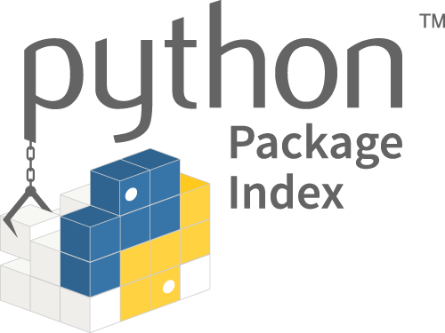

# DataPy CADi

This repository contains the materials for the **Data acquisition, wrangling and exploratory analysis in Python**, three days intensive [CADi](http://sitios.itesm.mx/va/capacitacion/1_2.html) (["Cursos de Actualización en las Disciplinas"](http://sitios.itesm.mx/va/capacitacion/1_2.html)) for faculty members at ["Tecnológico de Monterrey"](https://tec.mx/es) Institute.

The course covers subjects include the parsing and handling of data from different social sources, as well as the use of current frameworks for data-driven analyses.

  

 

For other data-analysis related topics please take a look at the [dataViz_CADi](https://github.com/Chipdelmal/dataViz_CADi) repository. Which contains exercises on data visualization in [R](https://www.r-project.org/), [Python](https://www.python.org/) and [Mathematica](https://www.wolfram.com/mathematica/).

## Contents

This workshop was created with flexibility in mind. As such, modules are fairly independent and can be followed in a different order than the one suggested here. For a topic-oriented breakdown of the contents, please have a look at the [sitemap](./sitemap.md).

### Day 01 (8h)

1. [Introduction](./md/introduction.md): Objectives, scope, requirements and expectations.
1. [Python 101](./md/python101.md): Introduction to the programming language.
1. [Python Environments](./md/environments.md): Using [anaconda](https://www.anaconda.com/) and [virtualenv](https://virtualenv.pypa.io/en/latest/) to avoid packages clashes.
1. [IDE's](./md/ides.md): Using [Jupyter](https://jupyter.org/), [Spyder](https://www.spyder-ide.org/), and [Atom](https://ide.atom.io/) for python code development.
1. [Data Wrangling](./md/dataWrangling.md): Using [pandas](./pandas.md), [matplotlib plots](./matplotlib.md), and [scikit-learn](./scikitLearn.md) to

### Day 02 (8h)

1. [Python 102](./md/python102.md): Object-oriented concepts.
1. [Git](./md/github.md): Version control using [github](https://github.com/) for code development, sharing and collaboration.
1. [Twitter](./md/twitter.md): Interfacing with the API to get trends,
1. [Google Trends](./md/googleTrends.md):

### Day 03 (8h)

1. [Python 103](./md/python103.md): Advanced topics (code efficiency and scopes).
1. [Pypi](./md/pypi.md): Installing, browsing, and creating packages in the [Pypi](https://pypi.org/)/[TestPypi](https://test.pypi.org/) indexing system.
1. [GeoData](./md/geoData.md):
1. [Plotting](./md/plots.md): Using [matplotlib](https://matplotlib.org/) and [seaborn](https://seaborn.pydata.org/) to generate meaningful data representations.

## Resources

### Tools and Packages

* [anaconda](https://www.anaconda.com/): DataScience/Package manager platform for python and R.
* [atom](https://atom.io/): Versatile IDE for R, Python, Markdown, Javascript, amongst others.
* [matplotlib](https://matplotlib.org/): Python's most popular package to plot data.
* [numpy](https://www.numpy.org/): Highly efficient array manipulation in Python.
* [pandas](https://pandas.pydata.org/): Popular dataframe manipulation in Python.
* [plotly](https://plot.ly/): A good alternative for interactive plots in Python (similar to [Shiny](https://shiny.rstudio.com/) in [R](https://www.r-project.org/)).
* [onlinegdb](https://www.onlinegdb.com/online_python_interpreter): Online Python interpreter (originally developed for C and C++).
* [repl.it](https://repl.it/languages/python3): Online Python IDE and interpreter (also supports many other languages).
* [scikit-learn](https://scikit-learn.org/stable/): Data analysis and machine learning platform for python.
* [sympy](https://www.sympy.org/en/index.html): Symbolic calculus in Python.

### Online

* [Anaconda documentation](https://docs.anaconda.com/)
* [dataViz Book](https://serialmentor.com/dataviz/): Online book with data visualization examples and principles.
* [dataViz CADi](https://github.com/Chipdelmal/dataViz_CADi): "Data Visualization" CADi bootcamp taught in December of 2018 with code examples in [Python](https://www.python.org/), [R](https://www.r-project.org/) and [Mathematica](https://www.wolfram.com/mathematica/).
* [Git Carpentry Workshop](https://swcarpentry.github.io/git-novice-es/): A good git/github introduction for Spanish-speaking audiences (with lots of examples and explanations).
* [Python 3.7 documentation](https://docs.python.org/3.7/)
* [Mists of Data](http://ric70x7.github.io/blog_archive.html): [Ricardo's Andrade](http://ric70x7.github.io/) personal blog devoted to data analysis in Python with code examples.
* [Seaborn](https://seaborn.pydata.org/)
* [Virtualenv documentation](https://virtualenv.pypa.io/en/latest/)

### Books

* [Scott Chacon and Ben Straub (2019). Pro Git.](https://git-scm.com/book/en/v2)
* [McKinney, W. Python for Data Analysis - Data Wrangling with Pandas, Numpy and Python. (2018). ISBN-13: 1491957662](https://www.amazon.com/Python-Data-Analysis-Wrangling-IPython/dp/1491957662/ref=asc_df_1491957662/?tag=hyprod-20&linkCode=df0&hvadid=312140868236&hvpos=1o1&hvnetw=g&hvrand=6431209822672155744&hvpone=&hvptwo=&hvqmt=&hvdev=c&hvdvcmdl=&hvlocint=&hvlocphy=9032076&hvtargid=pla-396828636441&psc=1)
* [Géron, Aurélien (2018). Hands-On Machine Learning with Scikit-Learn and TensorFlow: Concepts, Tools, and Techniques to Build Intelligent Systems](http://shop.oreilly.com/product/0636920052289.do)
* [Lutz, M., & Ascher, D. (20015). Learning Python.](https://www.amazon.com/Learning-Python-5th-Mark-Lutz/dp/1449355730)
* [Lubanovic, B. (2015). Introducing python, modern computing in simple packages.](https://www.amazon.com/Introducing-Python-Modern-Computing-Packages-ebook/dp/B00PHTRLO2)
* [Lutz, M. (2014). Python Pocket Reference.](https://www.amazon.com/Python-Pocket-Reference-Your-OReilly/dp/1449357016)
* [Beazley, D. (2013). Python Cookbook.](https://www.amazon.com/Python-Cookbook-Third-David-Beazley/dp/1449340377)
* [Russell Mathew A. (2013). Mining the Social Web: Data Mining Facebook, Twitter, Linkedin, Google+, Github, And More ](https://www.amazon.com/Mining-Social-Web-Facebook-LinkedIn/dp/1449367615)

### Author: [Ph.D. Héctor Manuel Sánchez Castellanos](https://chipdelmal.github.io/)

Contact: [ sanchez.hmsc@berkeley.edu | chipdelmal@gmail.com ] 
My main projects: [ [MGDrivE](https://marshalllab.github.io/MGDrivE/) & [MoNeT](https://chipdelmal.github.io/MoNeT/) ] 
My personal website: [ [chipdelmal.github.io](https://chipdelmal.github.io/) ]

 
