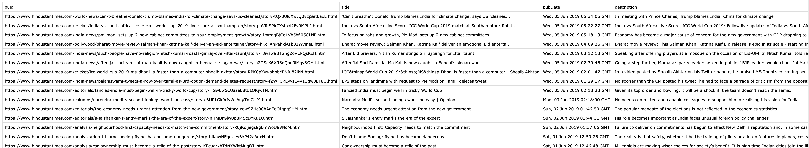

# dataPy: [RSS and XML](https://en.wikipedia.org/wiki/RSS)

[RSS](https://en.wikipedia.org/wiki/RSS) is an XML-based format for the communication specially tailored for news outlets and for the aggregation of different sources in the same platform.

##  Exercises

### [Exercise 1: RSS feed](../scripts/xmlParser.py)

Parsing an RSS feed file into a CSV for analysis.

### [Exercise 2: iTunes Playlist Parser](https://github.com/Chipdelmal/pyTunesPlaylist)

Creating a python terminal script that takes in an iTunes playlist and copies the songs to a selected folder.

##  Resources

* https://en.wikipedia.org/wiki/RSS
