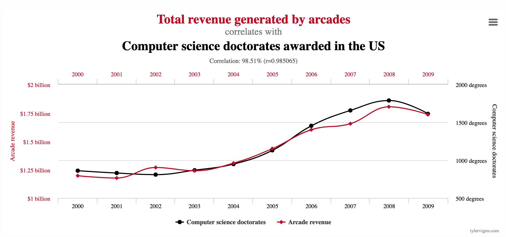
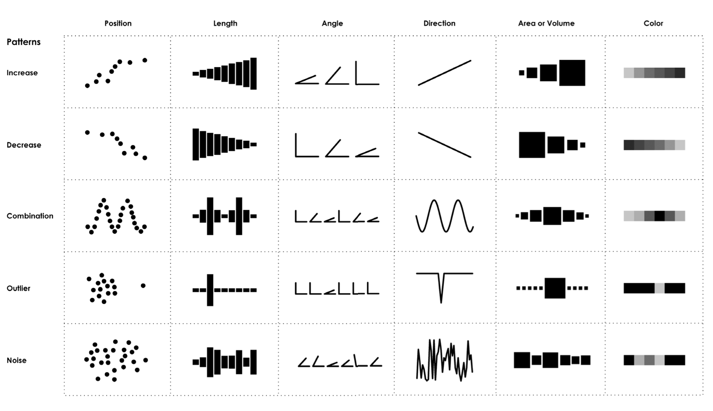
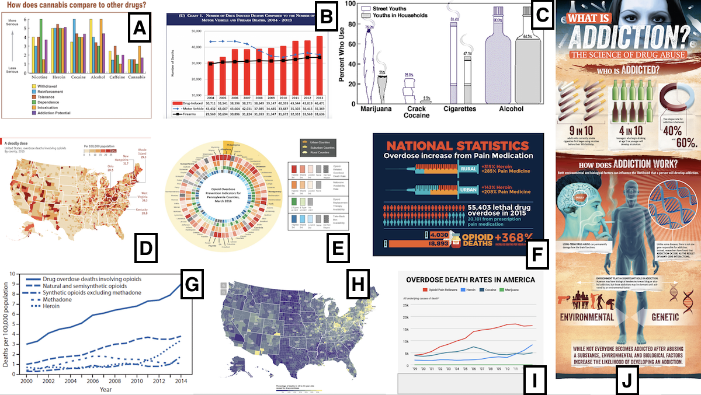
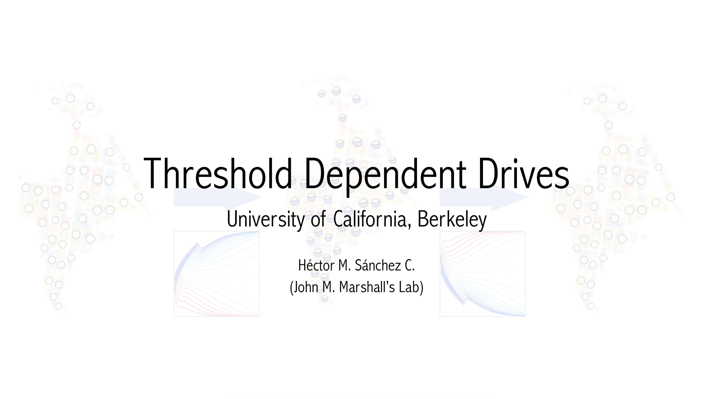
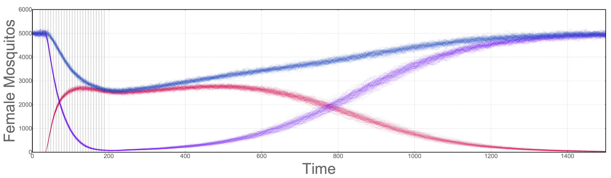

# dataPy: A Story to Tell

At the core of any data analysis task, there is an underlying story about how the data was gathered, why, and how we use it to obtain knowledge.

## Important Questions and Warnings

Lately, there has been a certain tendency to try to do machine learning and data science as and end, more than the means to solve problems. This is not really a problem in on itself, but it does pose challenges that might lead to undesired results.

### [Correlations Everywhere!](https://www.tylervigen.com/spurious-correlations)

Publicly available datasets are good to do initial explorations of promising research avenues. It is important to note, however, that analyzing datasets over and over will, undoubtedly, return correlations between variables that would not do so in a carefully designed experimental framework.

Without statistical advice, and with some motivated reasoning, it is easy to fall into traps.

[_"Considering how big data's spurious correlations far outnumber the valid causal relationships, it's always best to approach them all with a healthy skepticism. Some people, such as data scientists, might have a personal or professional interest in believing the spurious. These beliefs, plus the natural human tendency to succumb to confirmation biases, tend to short-circuit the skepticism and critical thinking that we expect from the best analysts. The more intelligent and authoritative a data scientist or analyst is, the more likely they are to convince unwitting others that their wishful correlations are indeed valid."_](https://www.ibmbigdatahub.com/blog/big-datas-bogus-correlations)

### Are the data reliable? How is it being collected?

More often than not, data are gathered by people with intentions and budgets. As such, we need to acknowledge that our data are not free from biases and defects. This is specially difficult in the cases when we already have a formulated hypothesis we are trying to back up.

### Data will not generate knowledge by itself

Related to the previous point, the generation of knowledge will ultimately depend on the people who analyze the data (even in machine learning applications). Data contain information, but knowledge is different from information. We need to learn, and think carefully about what we do to our data in order to make the best use possible out of it.

### Do we have contact with the people who gathered the data?

Often neglected, but having contact or keeping in touch with the people who generated the data we are using can be extremely valuable. We can sometimes avoid a lot of data cleaning work by asking the team who generated the dataset if they have it in a different shape. Additionally, by asking them about some of the conditions in which the data were collected, we can make simplifications or validate some of our assumptions. Moreover, we should never assume that data gathering teams will openly collaborate with us. Data collection processes are usually expensive, and time consuming, so other teams might have good reasons to try to maintain the intellectual property of their data.

###  [Visualization Bias!](https://medium.economist.com/mistakes-weve-drawn-a-few-8cdd8a42d368)

Visualizing data without careful thought can lead to errors in perception. It is important to take this into account, not only to present our results, but specially when using visualizations. Changing the scales, clipping ranges, using confusing mappings, poor use of colors, amongst many others; are ways in which we can ofuscate the meaning of our results or change it to something that is not a real effect/result.

###  [Data mean different things to different people!](https://medium.com/multiple-views-visualization-research-explained/data-is-personal-what-we-learned-from-42-interviews-in-rural-america-93539f25836d)

We tend to think of data as a concrete, tangible, element without any allegiance or affiliation, which leads us to think that people will read it. As such, we need to be aware that thay might not look at our analyses and necessarily arrive to the same conclusions. We should always have statistical tests to backup our claims, however "evident" we might think they are.

[_"In fact, for many people, the data and the visualization were synonymous. For these people, the pipeline from data to design is clean and clear, without bias or rhetoric."_](https://medium.com/multiple-views-visualization-research-explained/data-is-personal-what-we-learned-from-42-interviews-in-rural-america-93539f25836d)

###  Look ahead for ways to effectively convey the ideas stored in the data

At the end of the day, we want data to mean something not only to us, but to our teams and funders. This is why, at each stage of our project it is worth backing up a bit and thinking what is the meaning/goal of our current work; and how it can be presented to other persons.

### Get personal with the data

While having a team to do the data wrangling for us, there is no real substitute to spending time looking at the data in different ways. Even though it is usually regarded as a tedious and boring task, handling our own data is a great way to find inconsistencies, trends, correlations, missing values and spotting potential methodological errors.

