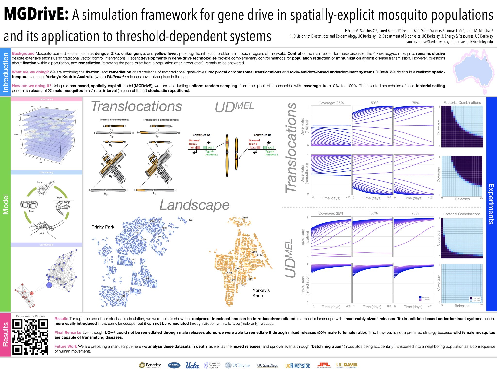

# dataPy: A Story to Tell

At the core of any data analysis task, there is an underlying story about how the data was gathered, why, and how we use it to obtain knowledge.

## Important Questions

### Why?

### How?

### What are we looking for?

### Are the data reliable?

## Warnings!

###  Data are not Unbiased

###  [Correlations Everywhere!](https://www.tylervigen.com/spurious-correlations)

###  [Visualization Bias!](https://medium.economist.com/mistakes-weve-drawn-a-few-8cdd8a42d368)

###  [Data mean different things to different people!](https://medium.com/multiple-views-visualization-research-explained/data-is-personal-what-we-learned-from-42-interviews-in-rural-america-93539f25836d)

[_"In fact, for many people, the data and the visualization were synonymous. For these people, the pipeline from data to design is clean and clear, without bias or rhetoric."_](https://medium.com/multiple-views-visualization-research-explained/data-is-personal-what-we-learned-from-42-interviews-in-rural-america-93539f25836d)

## Bigger Picture

### Get personal with the data

###  Think of how the data relates to the project

###  Look ahead for ways to effectively convey the ideas stored in the data

