# dataPy: [Anaconda](https://www.anaconda.com/)

In this workshop, we will be using anaconda as our environment manager. The reason to prefer it over virtualenv is that it can be used with [R](https://www.r-project.org/) (which is also commonly used for data-analysis applications), and because it also provides a user interface, which makes it accessible for a wider audience.

[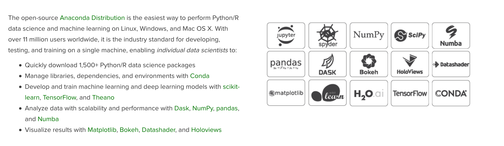](https://www.anaconda.com/distribution/)

Anaconda does not come bundled with our python installation, so we have to head to the [download section of the project's website](https://www.anaconda.com/distribution/) and install it.


[](https://www.anaconda.com/distribution/)

Once we've installed it, we can move forward to creating the environment we will use throughout the bootcamp.

<hr>

## Creating the environment

In this section, we will create the **conda** environment we will be using throughout the course. The instructions to do it on the user interface are shown, with the equivalent terminal comands shown underneath.

### Importing from a YML file

If we already have a **YML** file with the specifications of the package, we can click on "Import":

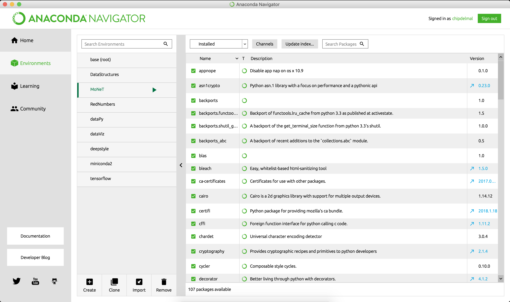

Then look for our specification file:

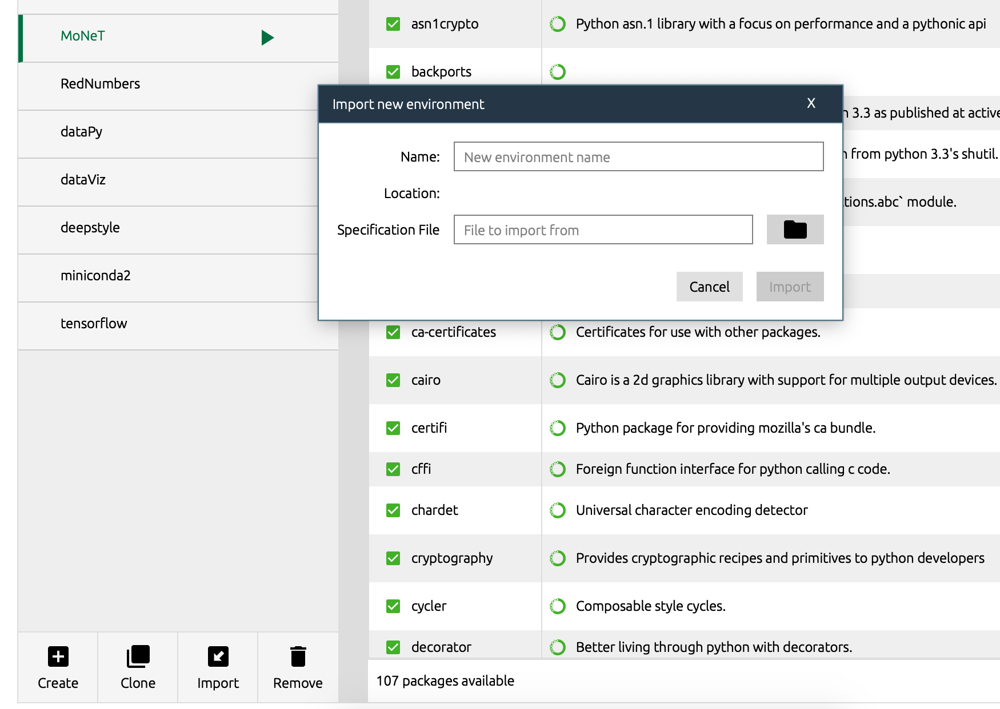

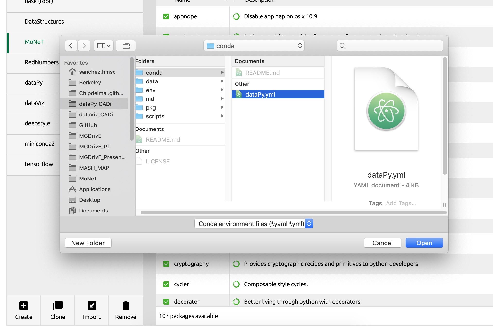
```bash
conda env create -f dataPy.yml
```

Give it a name:

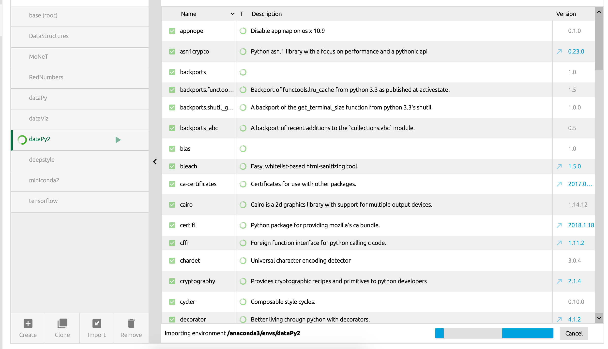

And we should be done!

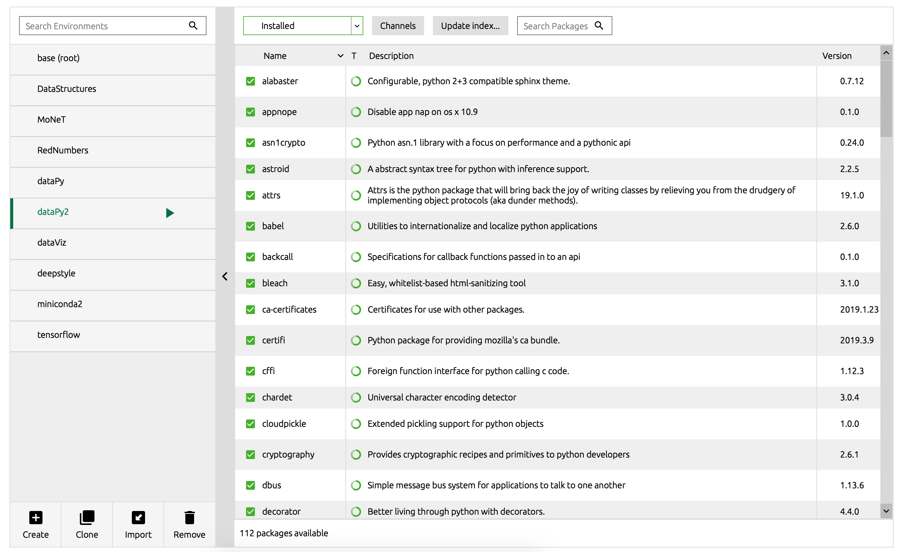

### Creating a new environment from scratch

To create an environment from scratch, we first click the "Create" button and set a name. We then select the python version, and click create.

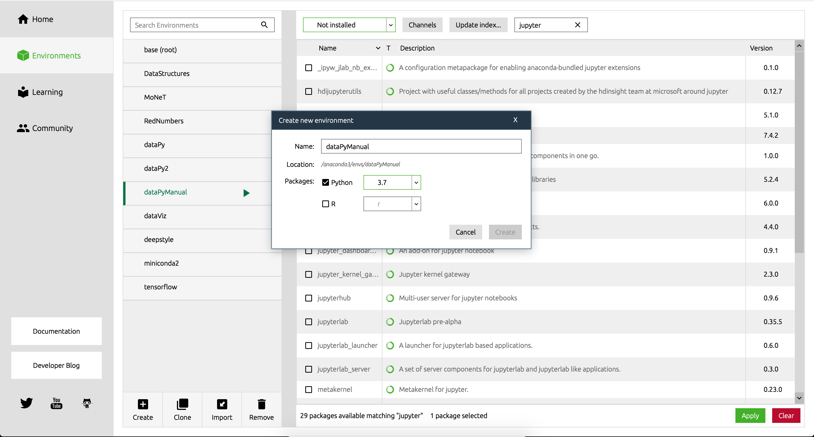
```bash
conda create -n dataPy python=3.7
```

We can install new packages by selecting the "Not installed" option in the dropdown menu:

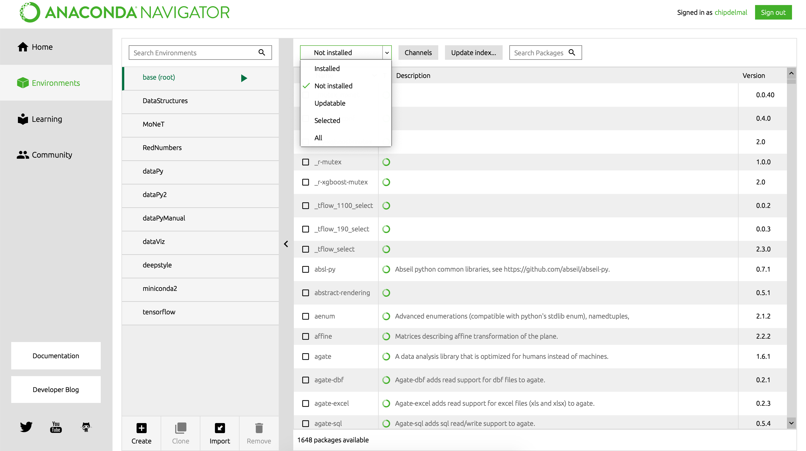

Searching for the package we want to install, and clicking "Apply":

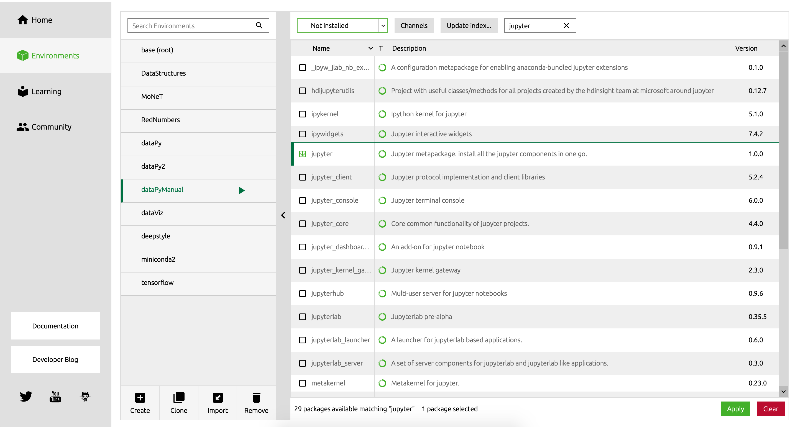

```bash
source activate dataPy
pip install pandas
pip install numpy
pip ipykernel
pip install jupyter
conda deactivate
```

We can also launch jupyter from our package:

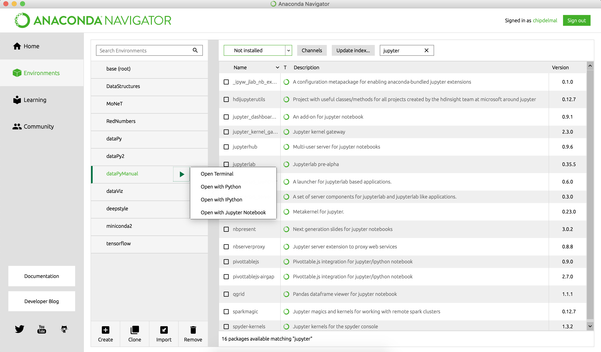

And create a new notebook with our kernel:

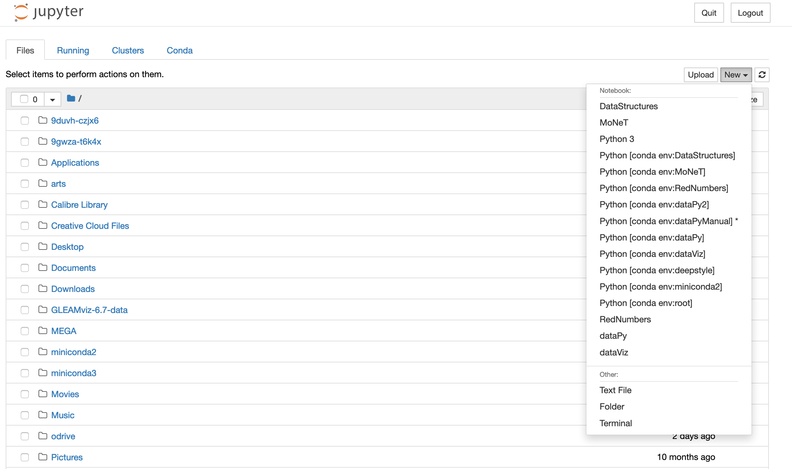
```bash
source activate dataPy
jupyter notebook
```

An important note is that we might need to install [nb_conda_kernels](https://github.com/Anaconda-Platform/nb_conda_kernels) for all of our kernels to be automatically displayed in Jupyter:

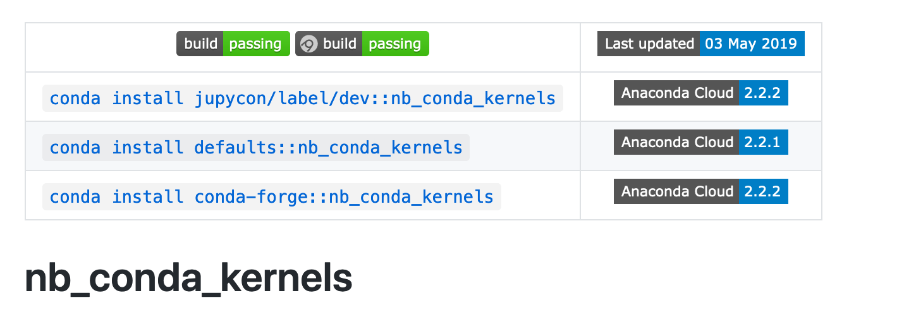

Or, alternatively, we can run the following command in the terminal:

```bash
source activate dataPy
python -m ipykernel install --user --name dataPy
```

To export our environment to a **YML** file, we can run:

```bash
conda env export > dataPy.yml
```

<hr>

##  Resources

* https://stackoverflow.com/questions/39604271/conda-environments-not-showing-up-in-jupyter-notebook
* https://github.com/Anaconda-Platform/nb_conda_kernels
