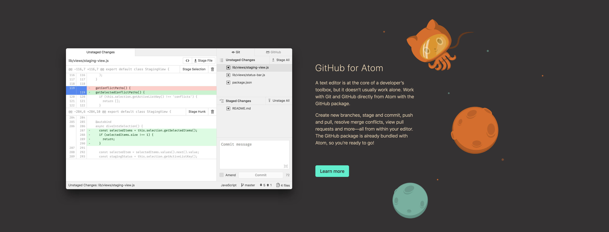
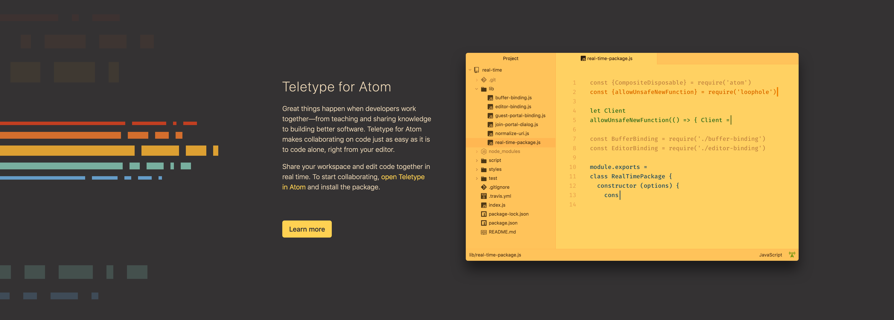
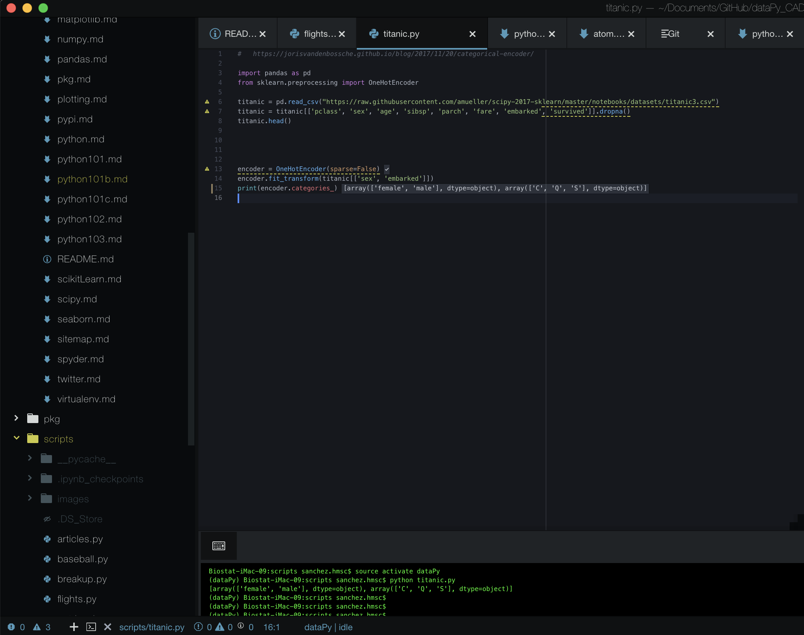
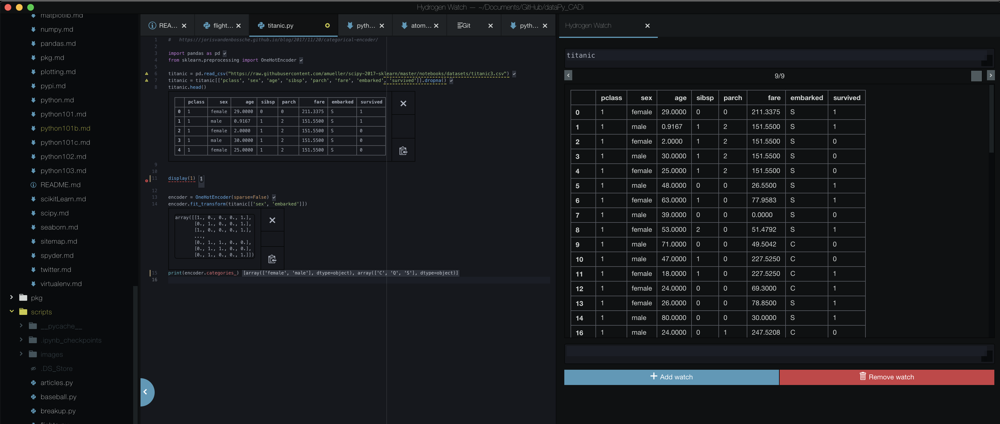

# dataPy: [Atom](https://atom.io)

[Atom](https://atom.io) is a cross-platform open-source IDE for development in several programming languages. This text editor was developed by the [github](https://github.com/atom) team as a fast and versatile IDE for users that want the maximum level of control over their development environment.

As mentioned before, as it was developed by the [github](https://github.com/atom) team itself, this version control system is directly integrated into the editor.

Some [atom](https://atom.io)'s most appealing features are:

* File system browser
* Terminal integration
* Autocompletion
* Package manager
* Themes
* Customization
* Lightweight

Additionally, it can be used for collaborative teaching/developing remotely with teletype:

##  Using [atom](https://atom.io)

### As text editor with terminal

In its most basic form, we can use [atom](https://atom.io) atom as a text-editor and launch our programs from the terminal (using [platformio IDE terminal](https://atom.io/packages/platformio-ide-terminal) or our system's console):

### With Hydrogen

For experienced users, combining atom with the [Hydrogen](https://nteract.io/atom) kernel runner might be a useful extension. This package allows running code line by line, and plotting results within the editor (along with variable "watchers").

 For more information on how to do this installation, looking at these guides  is highly recommended:
* [For Python, Julia and R](https://acarril.github.io/posts/atom-hydrogen)
* [For Python and R](https://jstaf.github.io/2018/03/25/atom-ide.html)

##  Resources

* https://atom.io/
* https://atom.io/docs
* https://atom.io/packages/hydrogen
* https://jstaf.github.io/2018/03/25/atom-ide.html
* https://atom.io/packages/ide-python
* https://atom.io/packages/hydrogen-launcher
* http://ipython.org/install.html
* https://acarril.github.io/posts/atom-hydrogen
