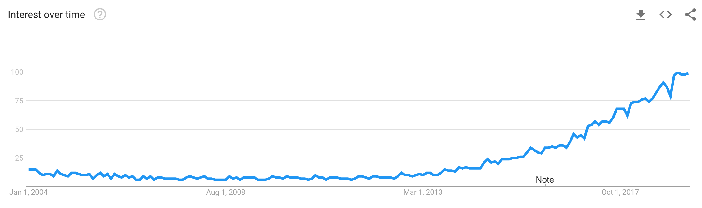
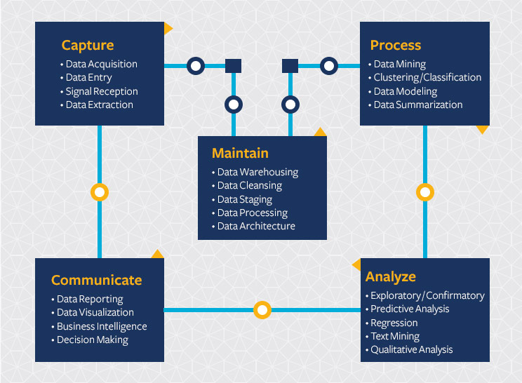
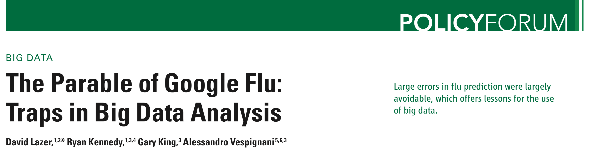
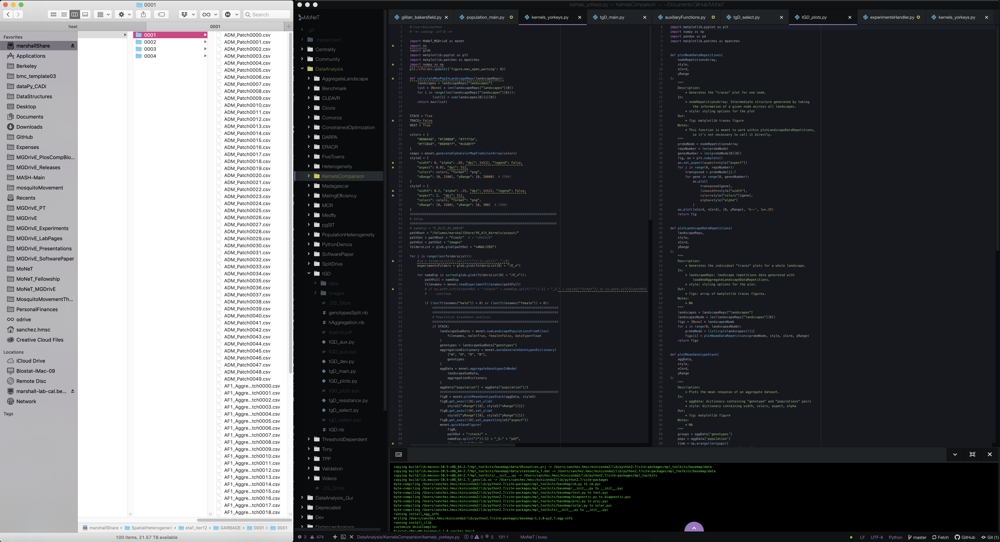

# dataPy: Data Primer

In the latest years, the interest for data gathering, processing, and analysis has spiked. Data science has become an extremely hot topic, and the need for professionals who are capable in processing information in fast, and flexible ways has increased in the latest years.

##  Data Science

Data science is broadly defined as the process of extracting knowledge from data. It is a multi-disciplinary field that, at its core, mainly combines: statistics, mathematics, machine learning and computer science.

This, however, comes at a cost. Analyzing data is a much more involved process than just collecting information and drawing correlations from it. It is important to understand that data itself won't tell us answers if we do not understand the underlying processes that generate it.

##  Data Wrangling

In general terms, "data wrangling" is the first step towards doing anything useful with information. It covers the process of loading information, collating it, and making it useful for further processing. In this step of the workflow, we design the algorithms to parse the information from different sources and we re-shape it so that we can extract knowledge from it.

### Good Data Wrangling

Good practices in data wrangling are not so different from the good practices in programming. Namely, we need to

* Is as flexible as possible
* Is "readable"
* Is open source*
* Is not limited to one application

### Warning!

We should never expect that data will be provided in a clean, ordered way. Even in the best of conditions, data will be missing, row and column labels will be duplicated, there will be blank lines, numbers and letters will be mixed. It is a common practice to underestimate the time it will take to pre-process

### How to Get Started

The whole concept of "data wrangling" can sound daunting at first. This is, in part, because it is usually mixed with the applications in machine learning and big data. At its core, data manipulation is just that: cleaning and shaping data so that we can do meaningful things with it.

##  Sources

* https://datascience.berkeley.edu/about/what-is-data-science/
* https://trends.google.com/trends/explore?date=all&q=data%20science
