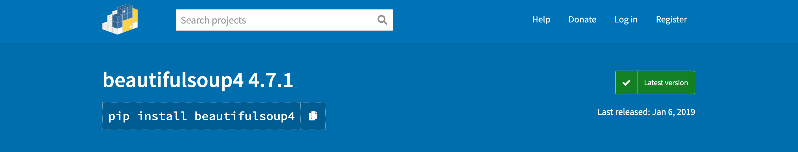
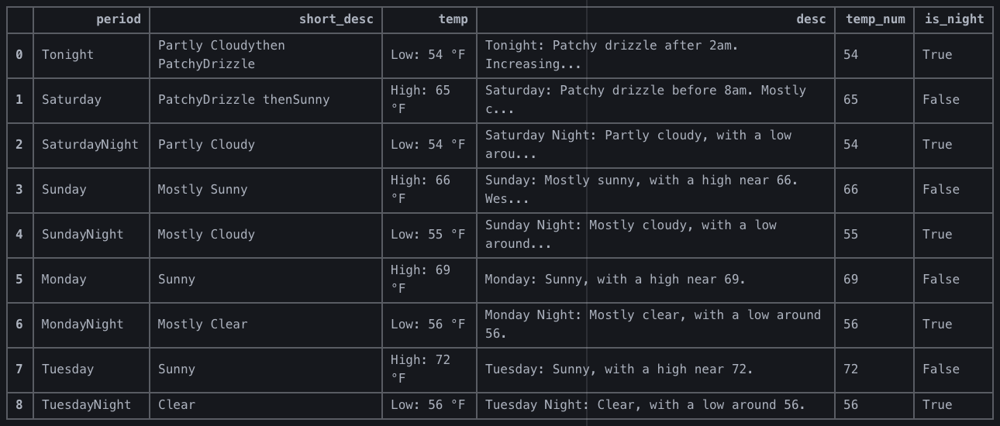
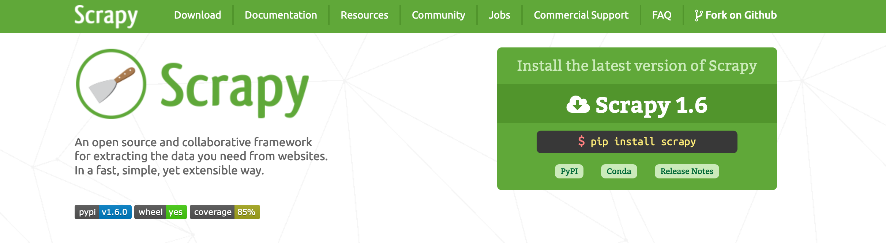

# dataPy: Data Sources

##  OpenSource Archives

* https://archive.ics.uci.edu/ml/index.php
* https://www.kaggle.com/
* https://registry.opendata.aws/
* https://www.openstreetmap.org/

##  Web Scrapping

The main web scraping tools for python are [BeautifulSoup](https://pypi.org/project/beautifulsoup4/) and [Scrapy](https://scrapy.org/). In general terms, [BeautifulSoup](https://pypi.org/project/beautifulsoup4/) is favored for simple tasks, whilst [Scrapy](https://scrapy.org/) is more flexible and comprehensive (for a more thorough comparison, please look at this [DataCamp post](https://www.datacamp.com/community/tutorials/making-web-crawlers-scrapy-python)).

### [BeautifulSoup](https://pypi.org/project/beautifulsoup4/)

[types of objects](https://www.crummy.com/software/BeautifulSoup/bs4/doc/#kinds-of-objects)

####  [Exercise 1: Download the Weather Forecast](../script/soup.py)

### [Scrapy](https://scrapy.org/)

* https://www.dataquest.io/blog/tutorial-text-classification-in-python-using-spacy/
