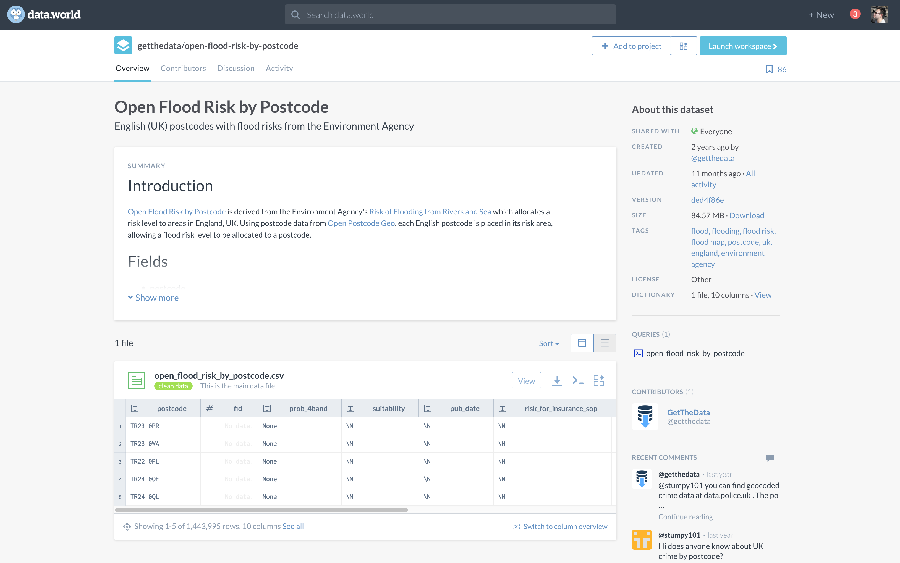

# dataPy: Data Sources

Due to the explosion of interest in machine learning and data science in general, there has been an explosion of publicly available data sources to work on. Some of these sources are:

* https://data.world/
* https://archive.ics.uci.edu/ml/index.php
* https://www.kaggle.com/
* https://registry.opendata.aws/
* https://www.openstreetmap.org/
* https://research.google.com/youtube8m/
* https://console.cloud.google.com/
* http://apps.who.int/gho/data/node.main

##  Examples and Exercises

In this bootcamp, we are gonna be looking at exercises for the following sources: [Google Trends](./googleTrends.md), [Twitter](./twitter.md), [Web Scraping](./scraping.md), [Geographic](./geographic.md).

##  Resources

* https://www.analyticsvidhya.com/blog/2016/11/25-websites-to-find-datasets-for-data-science-projects/
