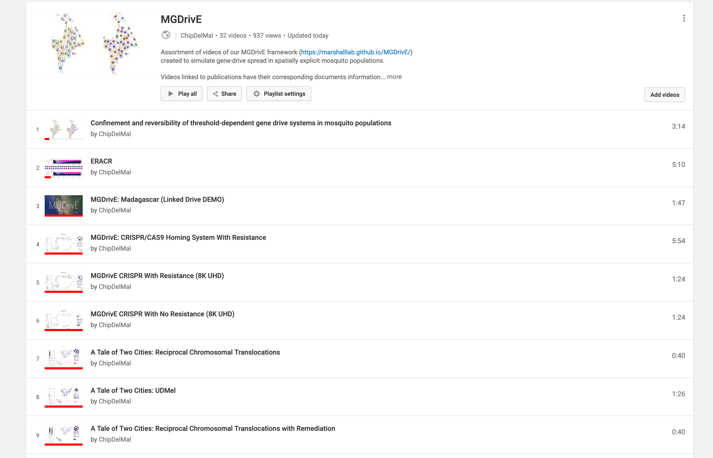

# dataPy: [Data Visualization](https://github.com/Chipdelmal/dataViz_CADi)

As it was mentioned before, data visualization is an area of study in on itself. In this bootcamp, we will revise the [data visualization primer of the dataViz_CADi](https://github.com/Chipdelmal/dataViz_CADi/blob/master/markdowns/dataVizPrimer.md), and extend with some python-specific examples and packages. Additionally, a list of plot-types and examples can be found in the same [repository](https://github.com/Chipdelmal/dataViz_CADi/blob/master/markdowns/plotTypes.md).

## Popular python dataViz packages

###  [matplotlib](https://matplotlib.org/)

###  [seaborn](https://seaborn.pydata.org/)

###  [plotly](https://plot.ly/)

##  Resources

* https://github.com/Chipdelmal/dataViz_CADi/blob/master/markdowns/dataVizPrimer.md
* https://github.com/Chipdelmal/dataViz_CADi/blob/master/markdowns/plotTypes.md
