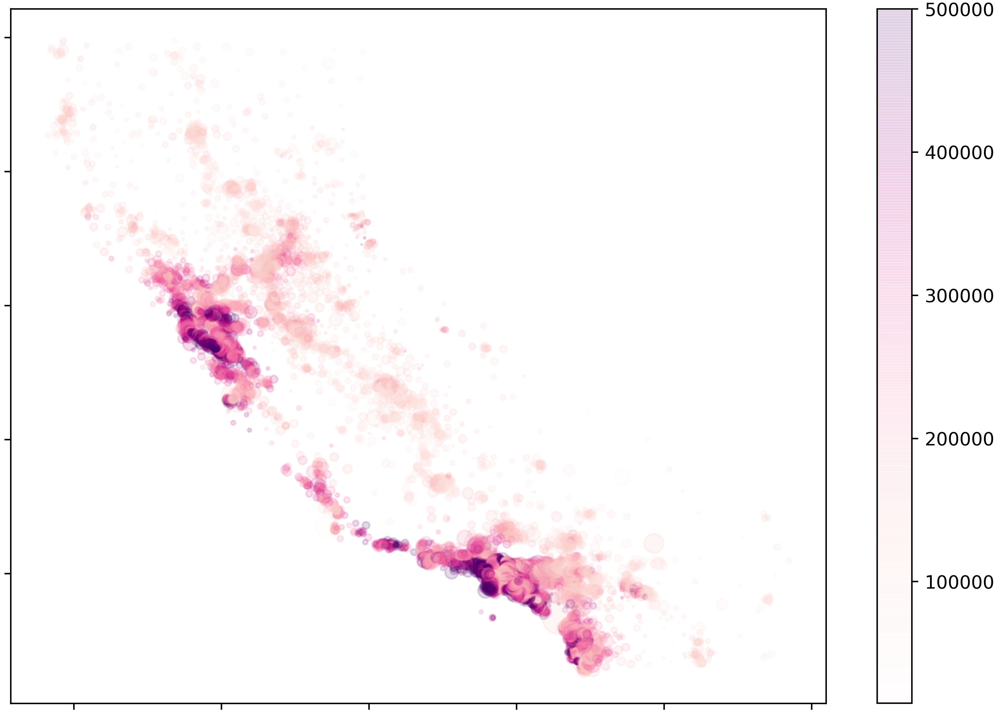

# dataPy: Data Wrangling

"Data Wrangling" is a really broad term that acts as an umbrella to the process of: obtaining, cleaning data, and automating scripts to update data.

It is usually an underestimated set of tasks that is of particular relevance in data science and machine learning applications, and it is also one that is often dreaded by programmers and scientists alike; but, when done correctly, it can give us great insights on what to expect from our data and can greatly reduce the debugging and training times of machine learning and data analysis applications.

Because of its relevance in machine learning applications, it is important to take into account that we can't expect to throw data into a set of algorithms and get reasonable results. Some of the common operations are:
* Imputing data
* Removing missing values
* Rescaling
* Subsetting
* Dealing with categorical data

##  [Exercise 1: California Housing (Exploration)](../scripts/housingExploring.py)

In this exercise, we will focus on loading a dataset into a [pandas](./pandas.md) dataframe, and performing an initial exploration through basic [matplotlib plots](./matplotlib.md).

##  [Exercise 2: Titanic (Encoding)](../scripts/titanic.py)

##  [Exercise 3: California Housing (Cleaning)](../scripts/housingCleaning.py)

The second part of the exercise involves the use of [scikit-learn](./scikitLearn.md) to impute data and pre process it for machine learning applications.

##  [Exercise 4: California Housing (Pipelines)](../scripts/housingTransforming.py)

The last part of this exercise is to use more advanced features of [scikit-learn](./scikitLearn.md) to create streamlined data-manipulation techniques so that they can be used for model training.
