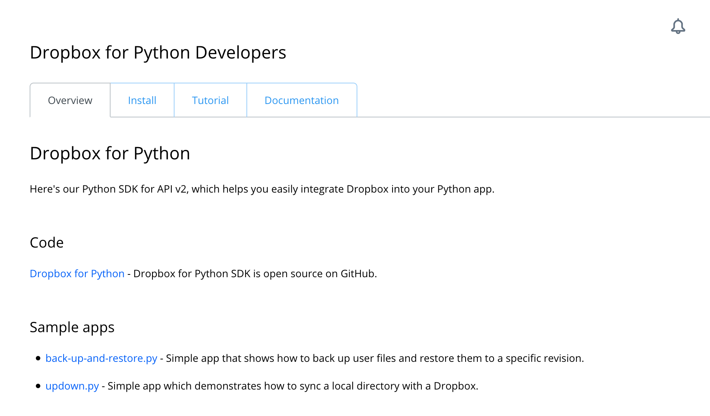
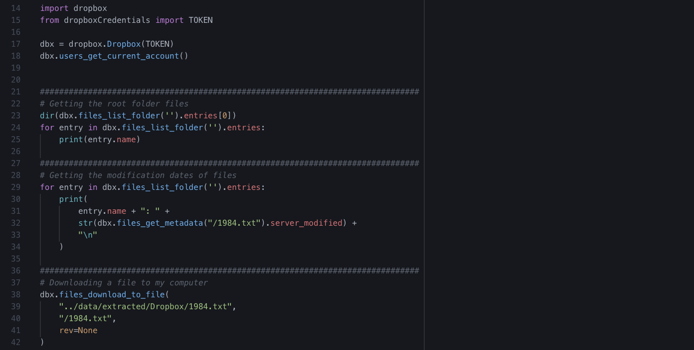

# dataPy: Dropbox

Dropbox is one of the most widely used cloud storage managers. Although it is not meant to be used as a database, for small projects it might be useful as a quick way to share data and collaborate.

##  Exercises

### [Exercise 1: Loading a connection to the API and backing up files](../scripts/dropboxConnection.py)

##  Resources

* https://github.com/dropbox/dropbox-sdk-python
* https://www.dropbox.com/developers/documentation/python
* https://dropbox-sdk-python.readthedocs.io/en/latest/
