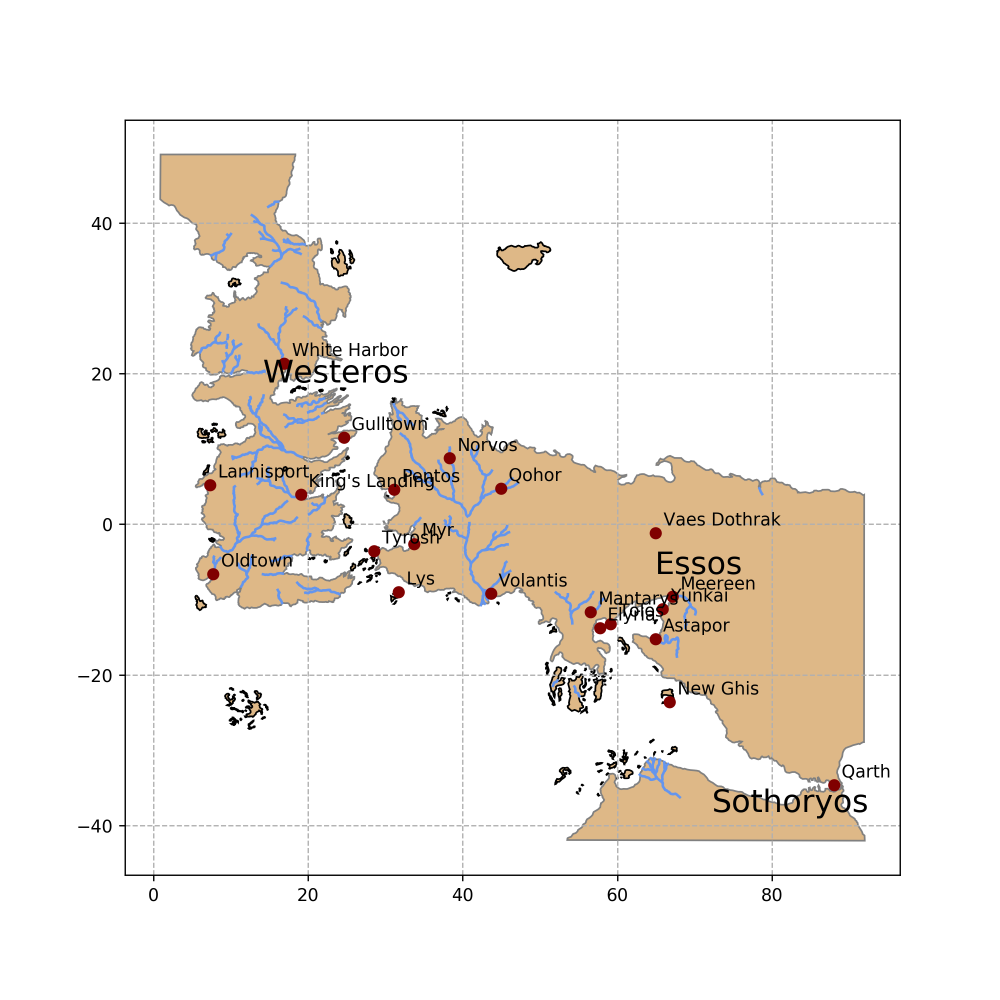
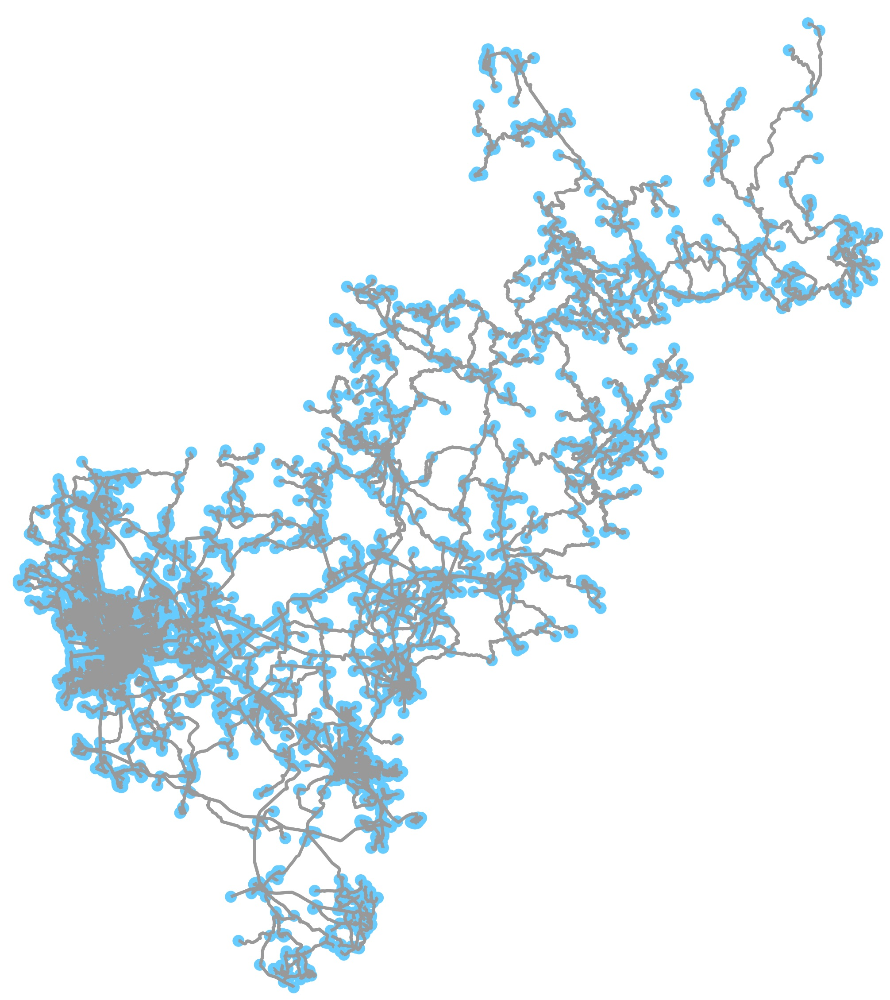
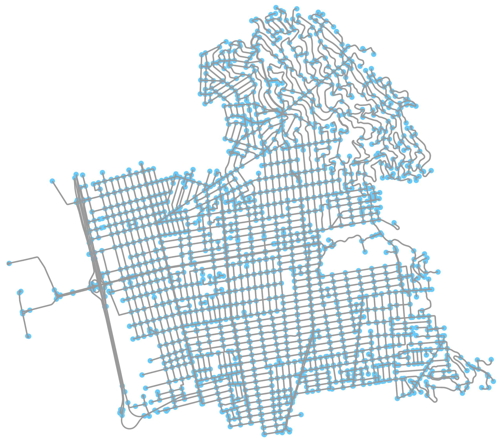
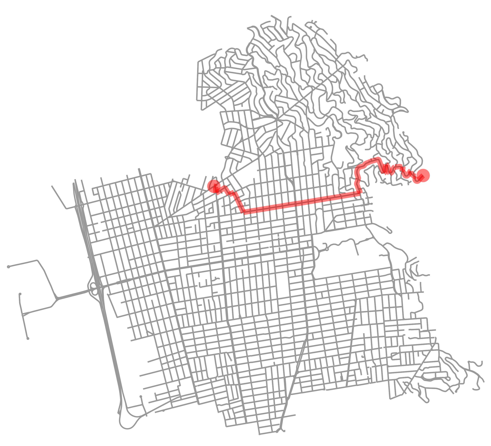
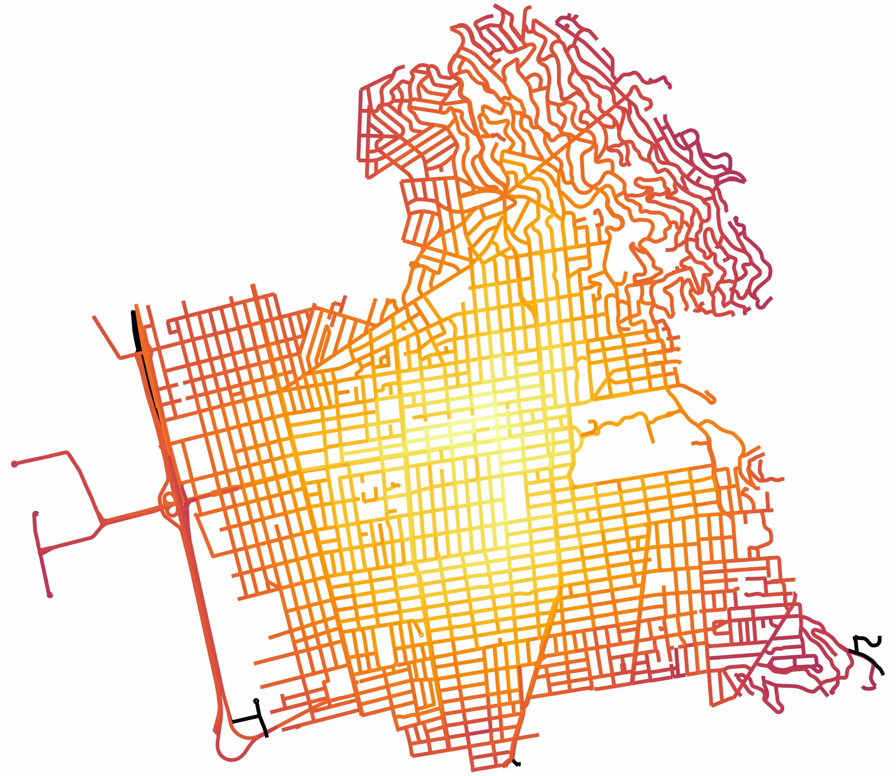
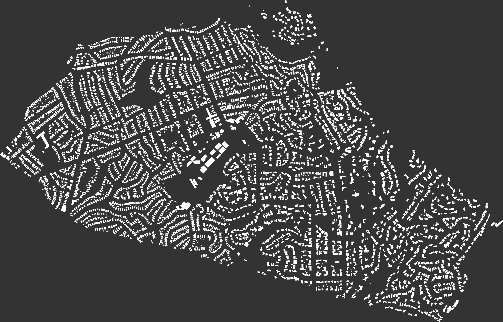

# dataPy: GeoData

Geographic data is usually one of the most complex types to manipulate. This is because it contains spatial information in the form of environmental factors, features, political boundaries, etcetera. Fortunately, as it is common to work with these types of datasets, there are several packages to facilitate performing some of the most common operations.

The go-to data type to store spatial information is: [shapefiles](https://en.wikipedia.org/wiki/Shapefile); which are composite containers.

##  [Shapefiles](https://en.wikipedia.org/wiki/Shapefile)

* SHP: Geometric objects
* DBF: Attributes of the objects
* SHX: Spatial indices of the objects

##  Exercises

##  [Exercise 1: Game of Thrones Map](../scripts/got.py)

Throughout this exercise, we will create a map by parsing a community-created dataset to represent the locations in the popular TV show "Game of Thrones".

##  [Exercise 2: OSMNX](../scripts/osmnxDemo.py)

In this example, we will use [osmnx](https://github.com/gboeing/osmnx) to download and analyze road network topologies). Additionally, it is pretty useful to parse geographic data from [openstreetmap](https://www.openstreetmap.org/) as shapefiles.

##  [Exercise 3: OSMNX Networks](../scripts/osmnxNetworkMetrics.py)

Further exercises with calculating roads networks data.

##  [Exercise 4: OMSNX Buildings](../scripts/osmnxBuildings.py)

Downloading a location and saving it to shapefiles.

##  Resources

* http://ric70x7.github.io/20190318_got.html
* https://github.com/mapbox/GOT-Inspired-Map
* https://github.com/gboeing/osmnx
* https://www.researchgate.net/publication/309738462_OSMnx_New_Methods_for_Acquiring_Constructing_Analyzing_and_Visualizing_Complex_Street_Networks
* https://www.researchgate.net/publication/316711249_Measuring_the_Complexity_of_Urban_Form_and_Design
