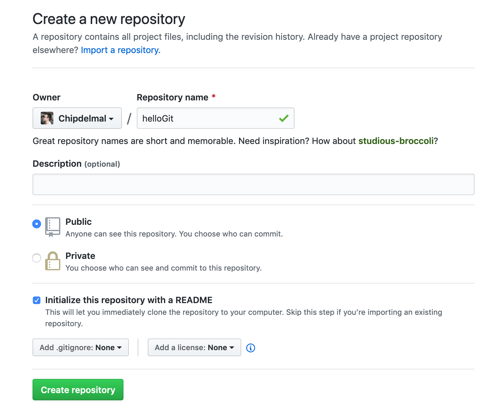

# dataPy: Hello git!

Time to start exploring git and github! We will be creating/setting up our accounts, and creating a repository to work with throughout the course.

<hr>

## Setting up an account

Let's get started with git and github by creating our account, and setting up a repository to work with.

### Creating an account in [github](https://github.com/)

Head to the [github website](https://github.com/) and create a new account (preferrably with the school's email, so that it is easier to setup [github education](https://education.github.com/) later if so desired).

[](https://education.github.com/)

Whilst there, make sure to also download the [github desktop app](https://desktop.github.com/)!

[](https://desktop.github.com/)

### Setup our local credentials

```bash
git config --global user.name "MY_USERNAME"
git config --global user.email "MY_EMAIL@DOMAIN.COM"
git config --global core.editor "nano -w"
```

### Creating a Github Repo




### Linking to a [Github](https://github.com/) Repo

```bash
git init
git remote add origin https://github.com/Chipdelmal/helloGit.git
git remote -v
git pull origin master
```

### Creating a file

```bash
nano trackMe.py
```

### Staging and Committing

```bash
git status
git add trackMe.py
git status
git commit -m "Created a 'Hello World' file."
git push origin master
```

### Making Changes

```bash
nano trackMe.py
git add *
git commit -m "Repeating the message 8 times."
git push origin master
```

### Ignoring Files and Folders

```bash
nano .gitignore
git add *
git commit -m "Adding gitignore."
git log --oneline --graph --all --decorate
```

### Restoring to a previous state

```bash
git checkout LOG_ID trackMe.py
git commit -m "Reverting to a previous state."
git push origin master
```

<hr>

##  A More Detailed Explanation

At first glance, this whole process might seem obscure and confusing but, over time, this process becomes natural and intuitive.

[](https://blog.osteele.com/2008/05/my-git-workflow/)

<hr>

## Resources

* https://blog.osteele.com/2008/05/my-git-workflow/
