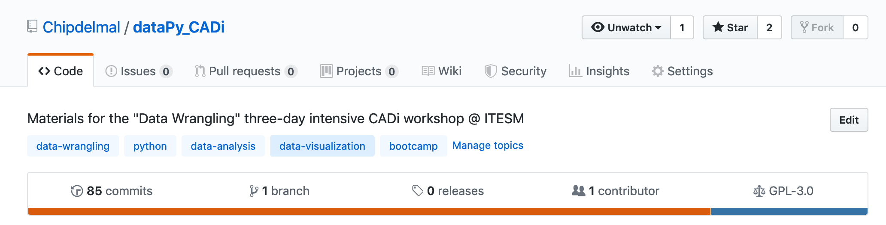

# dataPy: Forking

Forking is an essential task for git social coding. By forking a repository, we can download a snapshot of the contents of that repository and modify them as we see fit.

## Forking the [dataPy repository](https://github.com/Chipdelmal/dataPy_CADi)

Let's go to the [repository website](https://github.com/Chipdelmal/dataPy_CADi) and click on the fork button.

##  Cloning the [dataPy repository](https://github.com/Chipdelmal/dataPy_CADi)

Finally, let's click on the "Clone or Download" button, and the "Open in Desktop" link.

That's it! Just select a folder to download the repo to, and the process should finish in a couple of minutes.

##  An important note!

Forking a repository does not allow us to push code into the original repo outright. If we are planning to work as part of a team, the "owner" of the repository, should add them to the "Collaborators" list in the repo.

