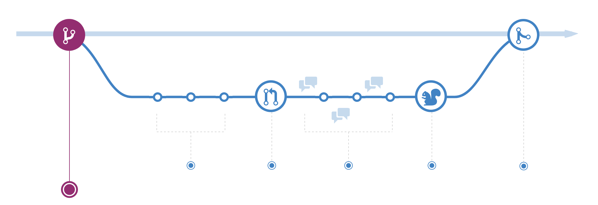
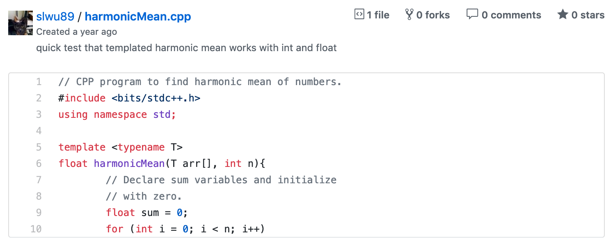
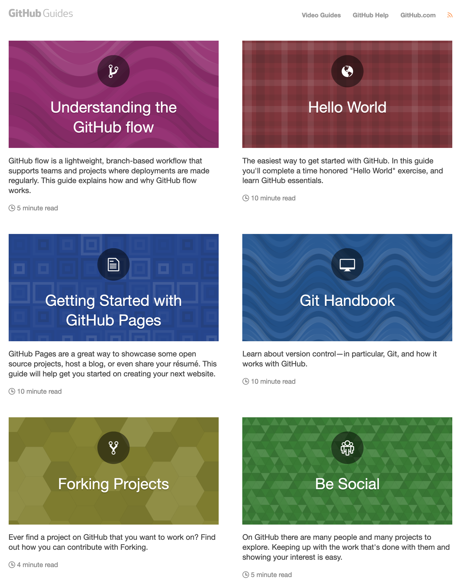

# dataPy: [Git](https://git-scm.com/) and [Github](https://github.com/)

Git is, first and foremost, a [version control](https://en.wikipedia.org/wiki/Version_control) system. But what is a [version control](https://en.wikipedia.org/wiki/Version_control) system?

We've all been in a situation in which we are working in a document/code and we make changes but we still want to keep a copy of the previous state of the file in case something goes wrong. So what do we do? We usually try to keep track of the files by adding version numbers, but it usually takes just a couple of days for this system to start showing it's deficiencies: it's difficult to standardize/enforce. Even worse, in coding we usually work with several different files at the same time, which makes the manual system impossible to maintain in the long run.

This is why, [git](https://git-scm.com/) exists: *To make persistent copies of the history of our source files so that we can always go back to a previously working version*.

##  [Git](https://git-scm.com/)

[Git](https://git-scm.com/) is, as mentioned before, the most popular distributed version control system.

### [Brief History](https://en.wikipedia.org/wiki/Git#History)

Git was born out of necessity when Linux developers were denied the free use of the protocol they were using to collaborate in the development of the operating system: [BitKeeper](https://en.wikipedia.org/wiki/BitKeeper). [Linus Torvalds](https://en.wikipedia.org/wiki/Linus_Torvalds) (Linux' creator) was frustrated by the speed of alternative version control distributed systems, so he started developing his own: [git](https://git-scm.com/); prioritizing scalability and "open sourceness".

### Advantages

* **It's decentralized:** There is no central server where all the information is stored and "checked-out". Instead, everyone involved keeps a full copy of the codebase.
* **It's widely supported:** All major operating systems support git (Linux and MacOS can run it from the terminal "out of the box").
* **It has a large community:** If you find yourself ever having questions, there's always someone willing to answer it. Alternatively, there are lots of [books](https://git-scm.com/book/en/v2) and [online resources](https://swcarpentry.github.io/git-novice-es/).
* **It's relatively simple to use:** With some practice, everyone can learn the fundamentals of git and leverage it's benefits.
* **Colaboration:** Git, and [github](www.github.com)  in particular, promotes collaboration by allowing several persons to work in the same codebase at the same time.
* **Strong support for non-linear development**: Branches and forks make concurrent design one of the most valuable features in large project development teams.

##  [GitHub](www.github.com)

[GitHub](www.github.com) is the most popular web-based [version control](https://en.wikipedia.org/wiki/Version_control) service that uses the [git](https://git-scm.com/) protocol (it is so popular that git and github are colloquially used as synonims). It is very popular for programming projects due to its ability to provide access control, bug tracking, wikis, feature requests, amongst many other features.

##  [Github](https://github.com/) Collaboration and Other Features

### [gh-pages](https://pages.github.com/)

Github provides a built-in way to create websites for our projects and even our personal site. For a brief tutorial on this feature, please have a look at the [dataViz_CADi](https://github.com/Chipdelmal/dataViz_CADi) [gh-pages](https://github.com/Chipdelmal/dataViz_CADi/blob/master/markdowns/ghPages.md) document, along with the [markdown section](https://github.com/Chipdelmal/dataViz_CADi/blob/master/markdowns/markdown.md); or [github's quick guide](https://guides.github.com/features/pages/).

### [Gists](https://help.github.com/en/articles/about-gists)

[Gists](https://help.github.com/en/articles/about-gists) make sharing small code snippets easy and straightforward. Got a function that could be useful to other people? Share it on a [gist](https://gist.github.com/). Every gist is a repository that can be cloned, and can be embedded in websites through [javascript](https://en.wikipedia.org/wiki/JavaScript).

### [Fork](https://guides.github.com/activities/forking/)

Do you like a project and think you can contribute or extend it? Create a fork to get a copy of the repository in which you can work independently. If you develop an improvement that might be worth sharing with the community, submit a "pull request".

### [Watch and Star](https://guides.github.com/activities/socialize/)

Watch a repo to follow updates about it. Star it to save it in your "liked" repositories and show support.

### [Wikis](https://guides.github.com/features/wikis/)

Document your project using the integrated wikis and [markdown files](https://github.com/Chipdelmal/dataViz_CADi/blob/master/markdowns/markdown.md).

##  [Exercise 1: Creating a git repo](./git.md)

In this exercise, we will create our github account and cloning it to our local machine. We will be using this repository to store some of the scripts developed throughout the rest of the course. We will also learn how to for a repository to extend its codebase.

##  [Exercise 2: Forking the dataPy repo](./gitFork.md)

In the second git exercise, we will fork the [dataPy](https://github.com/Chipdelmal/dataPy_CADi) repository and clone it to our computers so that we can work with it throughout the rest of the workshop.

##  Resources

The use of git is a subject of study in on itself. The material taught as part of this course is a demonstration of some of the most common operations for small data science projects. For more information take a look at these other available resources:

* [Git Carpentry Workshop](https://swcarpentry.github.io/git-novice-es/)
* ["Pro Git" Free Download Book](https://git-scm.com/book/en/v2)
* [Github Quick Guides](https://guides.github.com/)
* [Git Alternatives](https://en.wikipedia.org/wiki/List_of_version-control_software)
* [Version Control Systems Comparison](https://en.wikipedia.org/wiki/Comparison_of_version-control_software)

