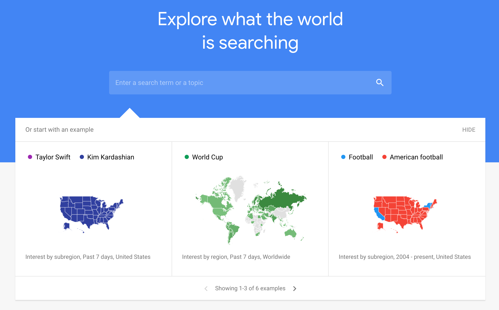
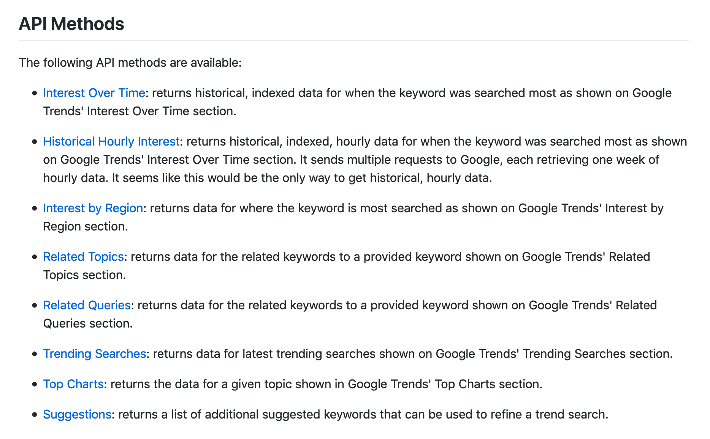
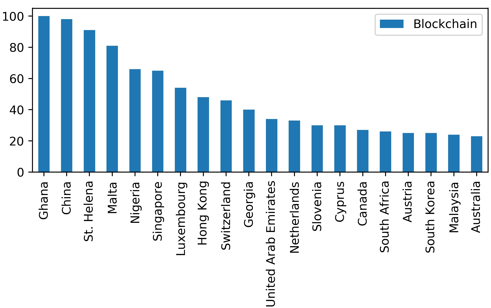
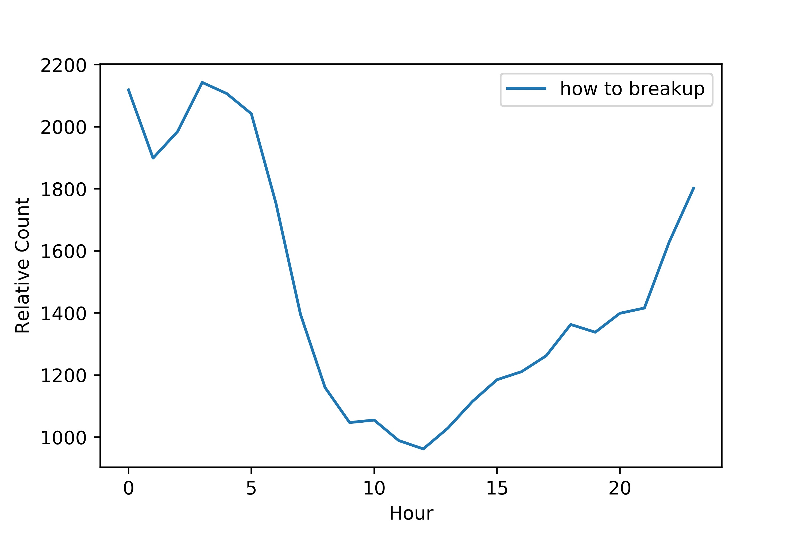

# dataPy: [Google Trends](https://trends.google.com/trends/?geo=US)

[Google Trends](https://trends.google.com/trends/) is a website dedicated to showcase and analyze the tendencies on google queries across the world and over time.

Unfortunately, no official API exists, so there is no built-in support to parsing and doing analysis over these data. This, however, is a minor limitation, as there are some alternatives in [python](https://www.python.org/), such as [pytrends](https://github.com/GeneralMills/pytrends).

##  [PyTrends](https://github.com/GeneralMills/pytrends)

This package is an unofficial [google Trends](https://trends.google.com/trends/) parser, maintained by a community of contributors. It is simple, yet sufficient for most applications.

### [Exercise 1: Using pytrends](../scripts/pyTrends.py)

### [Exercise 2: "How to Breakup"](../scripts/pyTrends.py)

## Other Resources
