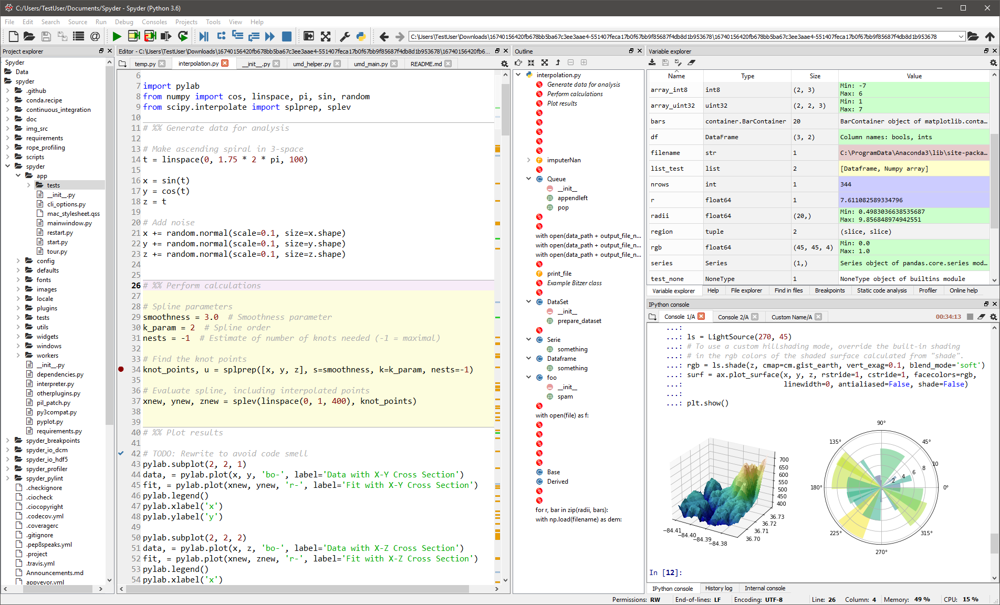
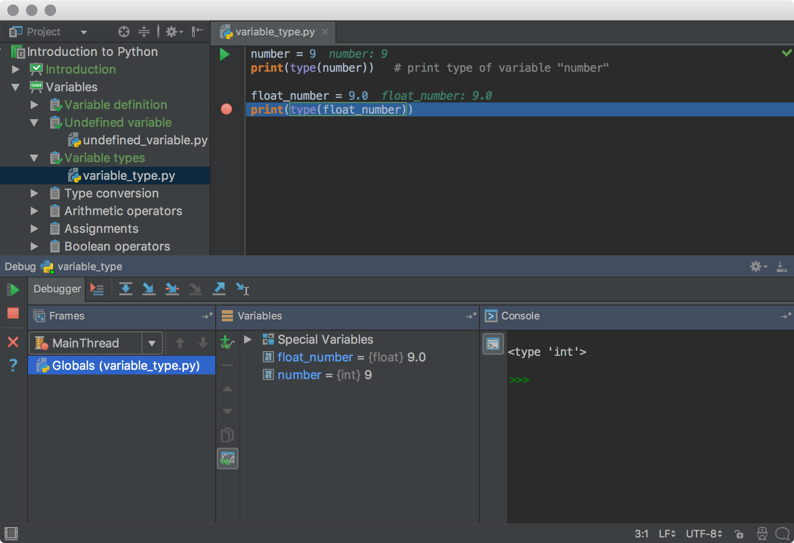
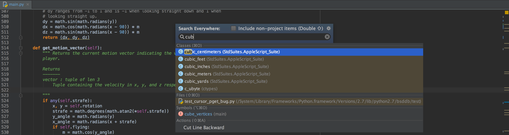
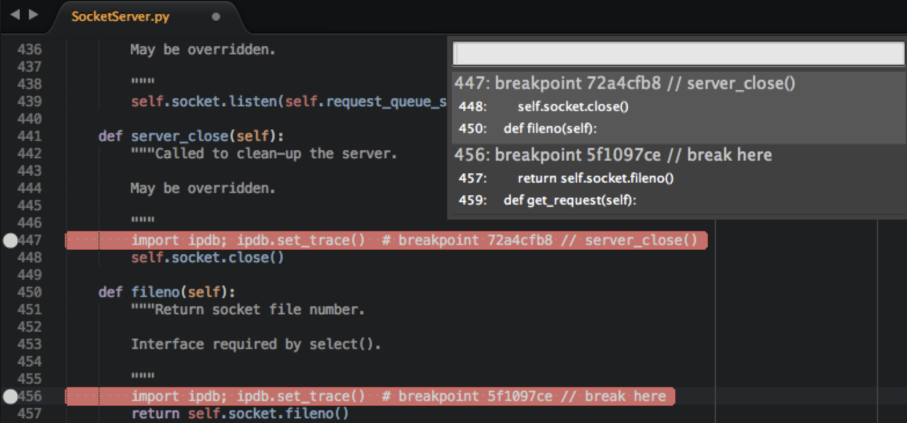

# dataPy: IDEs

Due to its popularity, python has several alternatives in terms of integrated developing environments. Throughout this bootcamp, we will go through three of the most commonly used open source options: [Spyder](https://www.spyder-ide.org/), [Jupyter](https://jupyter.org/), and [Atom](https://atom.io/).

##  Free and/or Open Source

### [IDLE](https://docs.python.org/3/library/idle.html)

[IDLE](https://docs.python.org/3/library/idle.html) is an integrated development environment that comes packed with the standard python installation. It is a pretty basic but useful as it is a cross-platform tool to get python code running.


### [Spyder](https://www.spyder-ide.org/)

A good option for people comfortable with [RStudio](https://www.rstudio.com/). This IDE mimics [R](https://www.r-project.org/)'s most popular coding environment and makes its functionalities available to Python programmers.



####  Installation

To install [Spyder](https://www.spyder-ide.org/) in our [Anaconda](https://www.anaconda.com/) environment, we can do the following in the terminal:

```bash
source activate dataPy
conda install spyder
conda deactivate
```

Or we can install it from the [Anaconda](https://www.anaconda.com/) GUI.

####  Launching a Session

```bash
source activate dataPy
spyder
```


### [Jupyter](https://jupyter.org/)

[Jupyter](https://jupyter.org/) is one of the most recent and famous IDEs created for Python. With this editor, we can generate interactive notebooks that can be shared with an [online viewer](https://nbviewer.jupyter.org/).

### [Atom](https://atom.io/)

Developed by [github](https://www-github.com), [Atom](https://atom.io/) is one of the most versatile IDEs currently available.


##  Alternatives

### [PyCharm](https://www.jetbrains.com/pycharm/)

A comprehensive IDE for professional Python development. This IDE contains most of the common features found in computer science industry applications, such as: smart code completion, refractoring, profiling, code generation, code analysis, smart code navigation, etcetera.




### Sublime Text

A flexible cross-platform IDE with lots of customization options. Excellent for multi-language projects and fast development turnarounds. 


