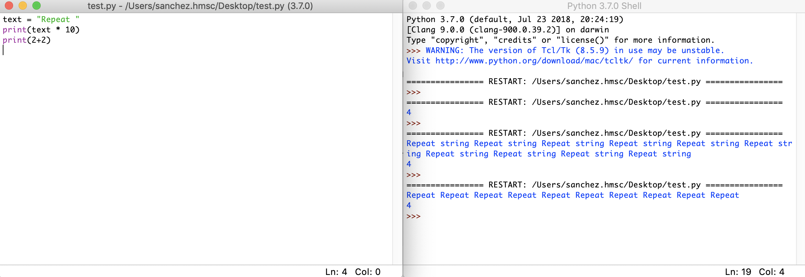

### [IDLE](https://docs.python.org/3/library/idle.html)

[IDLE](https://docs.python.org/3/library/idle.html) is an integrated development environment that comes packed with the standard python installation. It is a pretty basic but useful as it is a cross-platform tool to get python code running.

