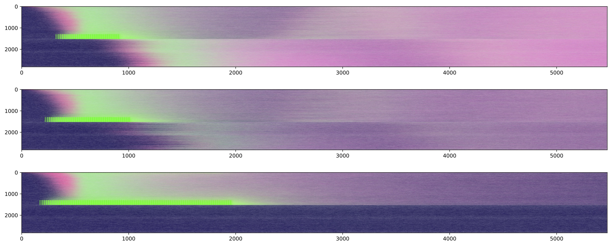

# dataPy: Introduction

Before getting into the code, let's take some time for introductions and objectives!

## [My background](https://www.researchgate.net/profile/Hector_Sanchez_Castellanos)

_I'm a Computer Scientist/Mechatronics Engineer working in modeling processes related to the spread/control of mosquito-borne diseases. My main lines of research focus on simulating the spatial spread of gene-drives in mosquito populations, and modeling the effects of mosquito-control interventions in mathematical/computational frameworks. I am particularly interested in the application of CS/Engineering methodologies (network theory, optimization techniques, individual-based modeling, etcetera) to stop the spread of vector-borne diseases. In the past I've worked in animal vocalizations analysis, robotics, computer vision, electronics instrumentation and automotive industry._

### Education

* Postdoc in Biostatistics and Epidemiology Department @ [University of California, Berkeley](https://www.berkeley.edu/)
* PhD in Computer Science @ [Tecnológico de Monterrey](https://tec.mx/es)
* BSc in Mechatronics Engineering @ [Tecnológico de Monterrey](https://tec.mx/es)

### [Research](https://scholar.google.com/citations?hl=en&view_op=list_works&authuser=1&gmla=AJsN-F6sB0xjpAcybR6MN1_Vqgpb21-oCGtqXDmrR9A3dQKCYyUCTQNsFj_OzxKrEtxKdDgFnlS7CsjGqaxWZ2acMQDLODMKQuvwHhLBeaKHKNtEX9KoT4g&user=OeOYQqEAAAAJ)

####  [MGDrivE](https://marshalllab.github.io/MGDrivE/): Mosquito Gene Drive Explorer (UC Berkeley)

*Dev team: One Postdoc (Computer Science) + Two PhD Students (Computational Biology & Biophysics/Biostatistics)*

####  [MoNeT](https://chipdelmal.github.io/MoNeT/): Mosquito Networks Taskforce (UC Berkeley, University of Washington, Tecnológico de Monterrey)

*Dev team: Four undergraduate students (3 Computer Science + 1 Statistics)*

####  [MASH](https://smitdave.github.io/MASH-Main/): Modular Analysis & Simulation for Health (University of Washington)

### Teaching and Mentoring

* [Git Carpentry](https://bids.berkeley.edu/news/worldwide-audience-bids-first-spanish-language-training-workshop-introducci%C3%B3n-r-y-git)
* [dataViz CADi](https://github.com/Chipdelmal/dataViz_CADi)
* Introduction to programming (Python)
* Two masters students' thesis ([Computer Science](https://www.researchgate.net/publication/333176157_A_Novel_Deep_Recurrent_Neural_Network_Architecture_for_Time_Series_Forecasting_of_Mosquito-Borne_Disease_Case_Counts?_sg=jZF4_n21L9YfmCO7PgPPn7Ee88X_PBqApRQqUyYptj6_PeWeR8vykorJ2fi1QgUrnMy-jRJST1kMozg618oMCM-J2xJUr7T7VejCLZiK.axstZynycTAv-JL3p_u1OTEwT-wGGpDuqol9kf3HIYQEMKB1Z4zp7V_SPuO5PvlXZZtBpS55gr3Z_hrejkhWsg))
* Four undergraduate students ([3 Computer Science](https://chipdelmal.github.io/MoNeT/Berkeley.html), [1 Statistics thesis](https://www.researchgate.net/publication/333204465_Quantifying_the_Relationship_Between_Spatial_Habitat_Distribution_and_Homing_Allele_Fixation_in_MCR_Gene_Drive_Systems_for_Aedes_aegypti_Mosquitoes?_sg=-tACnujvzrgzoaxq-46SNGTWAxPXD3mRQFFdZlLuMRdutuc5aFE7jRPgihOag43L1oaGv-QykTMK2FFHwQszW0p1DRL0rZOmHDoZNg0r.wR8OXPMPnpbhrMKumT0yMmLfXQMLCz8cXRyU2LQyC5yW0HkSAn98p5hG30XMiJQLV-uIsQxOVOAb4xYCqWV_Aw))

### Interests

* Mathematical/Computational modeling of spatiotemporal processes
* Data visualization and data analysis
* Application of computational optimization techniques
* Application of engineering problem solving techniques in public health contexts

##  Goals and Objectives

This is an intensive bootcamp designed to teach the fundamentals and tools used for data manipulation in Python. As such, it is good to keep in mind the over-arching objective of the workshop: **To understand and get familiar with Python's most commonly used tools to do data analysis**.

### [What will we cover?](./sitemap.md)

* **Python introduction**: Basic python concepts along with the management of packages, environments and best practices will be covered.
* **Python development IDE comparison**: We will touch on some of the most common ways to develop code in Python (Jupyter, Spyder, Atom).
* **Creating libraries**: How to bundle a python package so that others can install and run it.
* **Git**: Understanding git, how we can use it for version control, and how to collaborate
* **Data wrangling**: Using pandas and numpy for data manipulation

### This bootcamp is not...

* **... an in-depth Python course**: This three-day workshop is not intended to be a thorough Python course. Python is a very rich and deep programming language. It's flexibility and...
* **... a course on Data Analysis**: Data analysis is a rich and dynamic topic which is rapidly becoming a subject of study on its own. As such, it is impossible to cover...
* **... a course on Data Visualization**: Similar to data analysis, this is a very complex subject that should be covered in a different bootcamp. However, you can have a look at the [dataViz CADi repository](https://github.com/Chipdelmal/dataViz_CADi) for some ideas, scripts, and general information.
