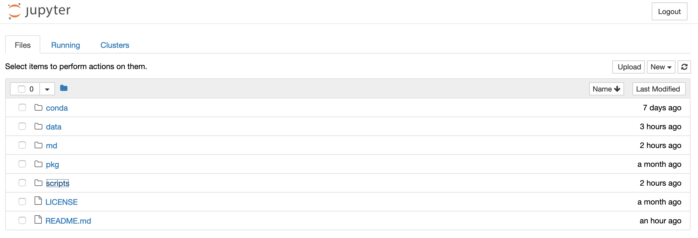
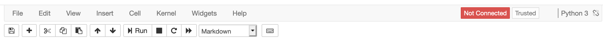
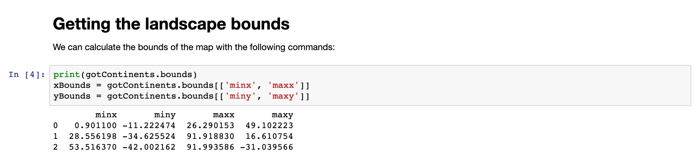

# dataPy: [Jupyter](https://jupyter.org/)

Jupyter notebooks are a novel was of doing Python development. They provide a simple and streamlined way to do scripting and analyses in a clean, organized way that is easy for others to read and understand. Their ability to integrate markdown makes it ideal for information sharing and data analysis.

##  Introduction

For [Mathematica](https://www.wolfram.com/mathematica/) users, jupyter notebooks will feel as familiar territory.

### Dashboard

The first visible screen of our interaction with jupyter is the dashboard, which shows the accessible files, kernels, terminals, etcetera.

### Header

The header is no different from any other toolbar we can access in other productivity-related software. All the common tasks can be performed on it, and we can even click on the help for the packages we are currently loading in our notebook.

### Body

The body is where we do our coding, and analysis. We will spend most of our time interacting with it, so it's worth spending time getting comfortable in navigating through it.

### Keyboard Shortcuts

##  Exercises and Examples

### [Exercise 1: Hello Jupyter!]()

### [Exercise 1]()

## Other Resources

* https://mybinder.org/v2/gh/ipython/ipython-in-depth/master?filepath=binder/Index.ipynb
