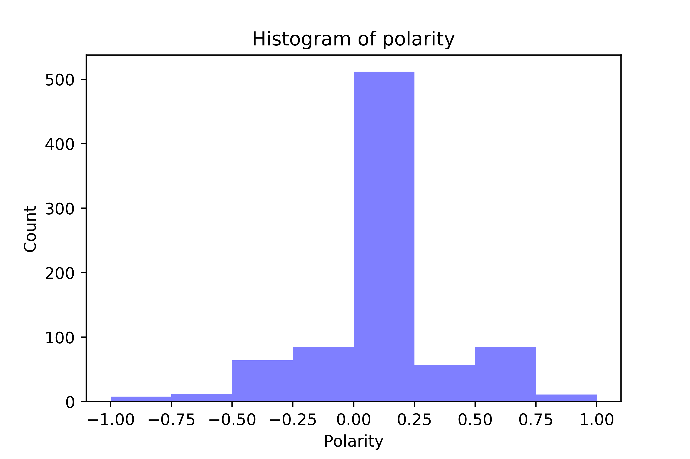

# dataPy: Basic Language Analysis

Natural language analysis is a large area of study in which we can not go deeply during this workshop, but we can definitely do some basic scripts to showcase the two main packages to do these kind of analyses: [nltk](https://www.nltk.org/) and [spaCy](https://spacy.io/).

##  Exercises

### [Exercise 1: Song Verses Sentiment Analysis](../scripts/sentiment.py)

Loading a **CSV** containing song verses into a pandas dataframe and analyze their polarity.

### [Exercise 2: Tweets Sentiment Analysis](../scripts/tweetsAnalysis.py)

Clean and analyze the sentiment of the tweets stored to the CSV file in the previous exercise.

##  Resources

* https://pypi.org/project/tweet-preprocessor/
* https://spacy.io/usage/models
* https://towardsdatascience.com/having-fun-with-textblob-7e9eed783d3f
