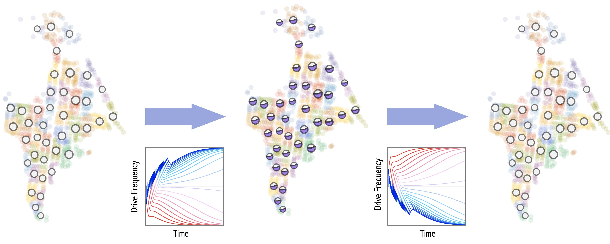
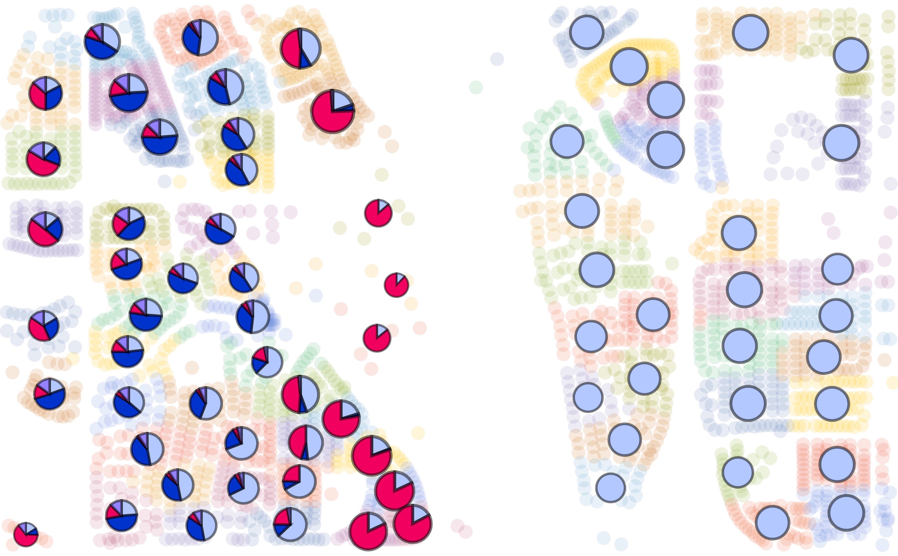
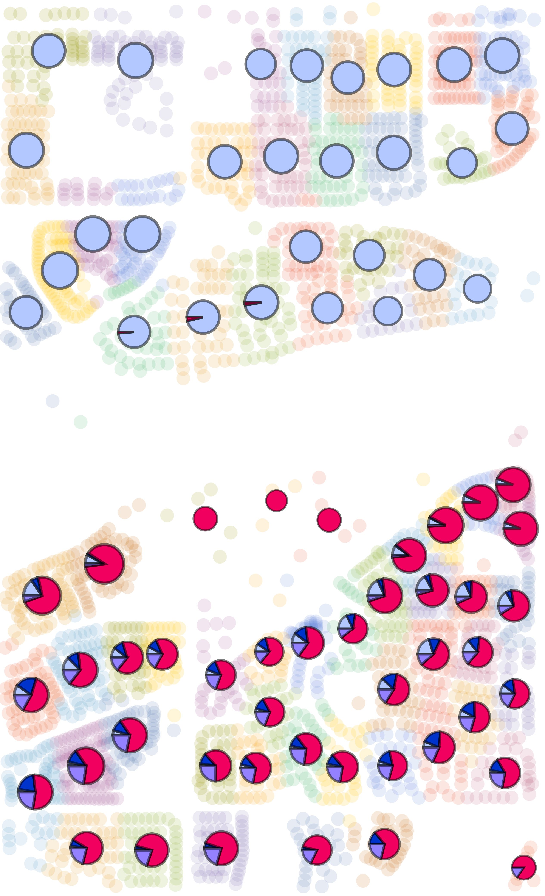
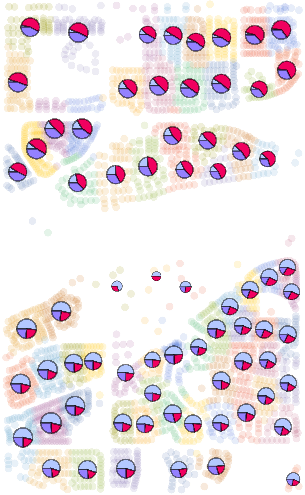
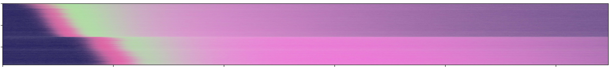
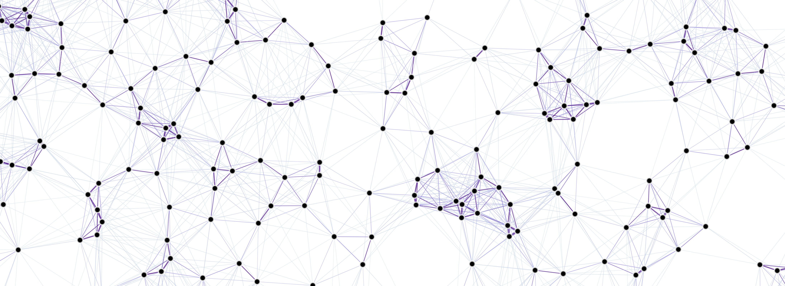
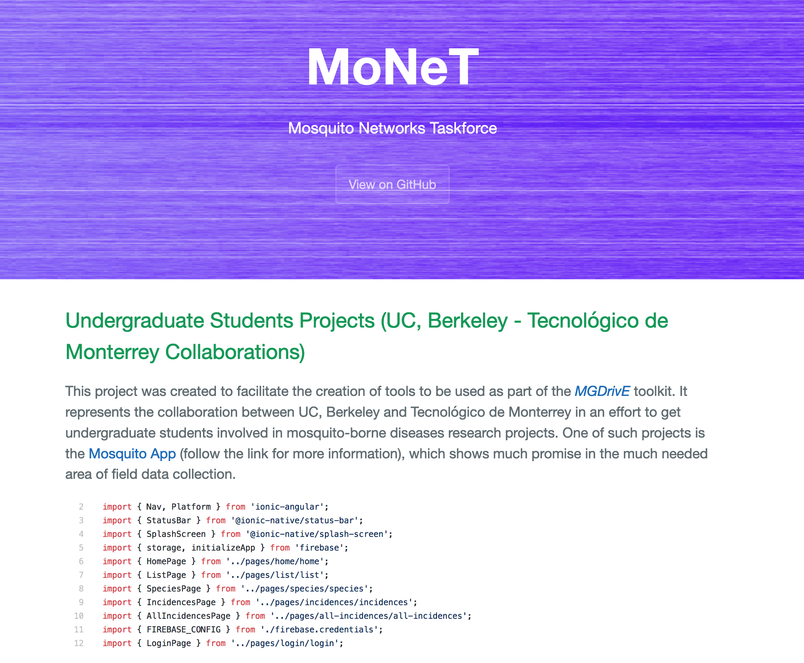
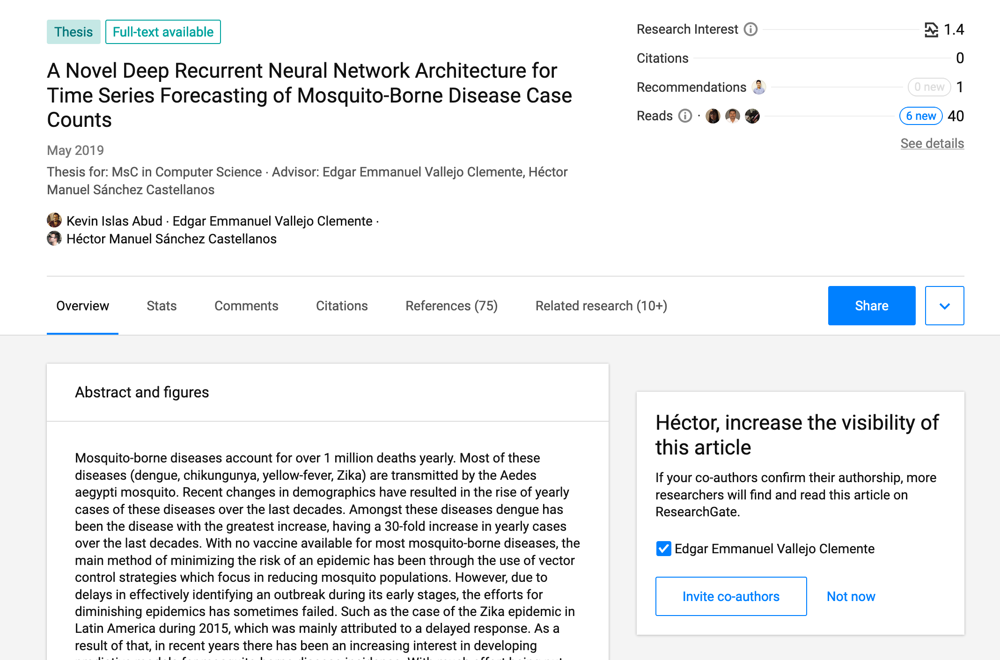
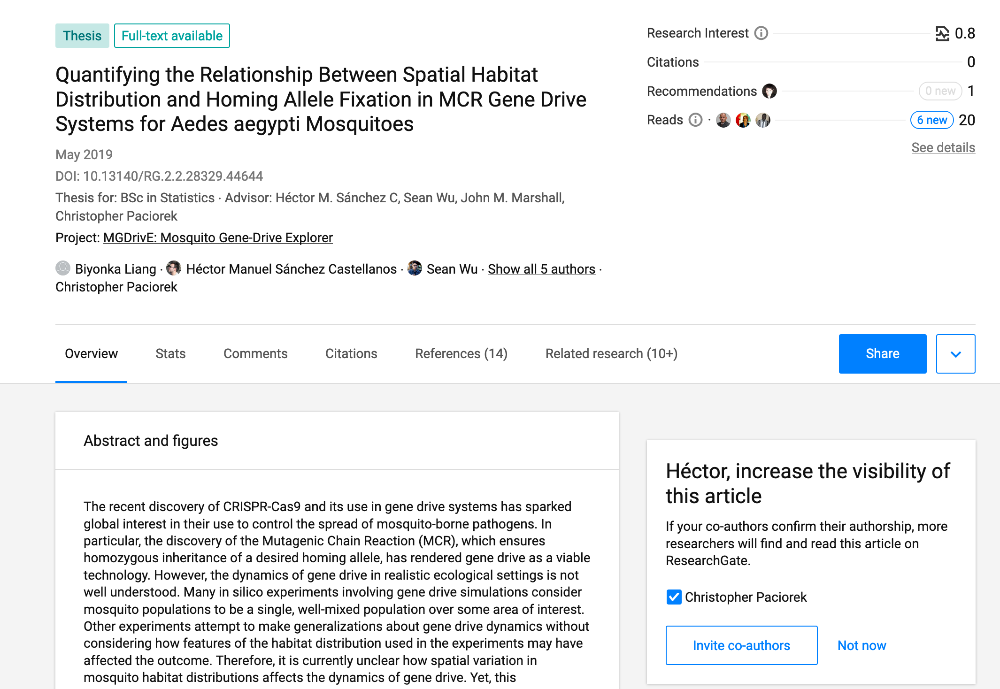
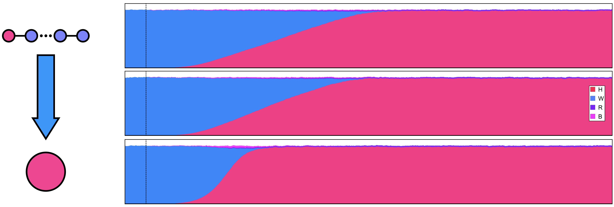

# dataPy: My Background

## Education

* Postdoc in Biostatistics and Epidemiology Department @ ([University of California, Berkeley](https://www.berkeley.edu/) & [Institute for Health Metrics and Evaluation](http://www.healthdata.org/) & [Tecnológico de Monterrey](https://tec.mx/es))
* PhD in Computer Science @ ([Tecnológico de Monterrey](https://tec.mx/es))
* BSc in Mechatronics Engineering @ ([Tecnológico de Monterrey](https://tec.mx/es))

## [Research](https://www.researchgate.net/profile/Hector_Sanchez_Castellanos)

###  [MGDrivE](https://marshalllab.github.io/MGDrivE/): Mosquito Gene Drive Explorer (UC Berkeley)

*Lead of dev team: Two Postdocs (Computer Science) + Two PhD Students (Computational Biology & Biophysics/Biostatistics)*

###  [MoNeT](https://chipdelmal.github.io/MoNeT/): Mosquito Networks Taskforce (UC Berkeley, University of Washington)

*Lead of Dev team: One postdoc + Four undergraduate students (3 Computer Science & 1 Statistics)*

###  [MASH](https://smitdave.github.io/MASH-Main/): Modular Analysis & Simulation for Health (University of Washington)

*Part of dev team: One Phd Student + Collaborators from [IBMRA](http://research.ibm.com/labs/africa/)*

### Additional Collaborations (Tecnológico de Monterrey)

## Teaching and Mentoring

* [Git Carpentry Workshop](https://bids.berkeley.edu/news/worldwide-audience-bids-first-spanish-language-training-workshop-introducci%C3%B3n-r-y-git) @ Berkeley: [BIDS'](https://bids.berkeley.edu/) first Spanish-language training workshop on programming, data analysis, and version control.
* [dataViz CADi](https://github.com/Chipdelmal/dataViz_CADi) @ Tecnológico de Monterrey: Data visualization in [R](https://www.r-project.org/), [Mathematica](http://www.wolfram.com/mathematica/) and [Python](https://www.python.org/).
* Introduction to programming @ Tecnológico de Monterrey ([Python](https://www.python.org/)).
* Co-Advising two masters students' thesis @ Tecnológico de Monterrey ([Computer Science](https://www.researchgate.net/publication/333176157_A_Novel_Deep_Recurrent_Neural_Network_Architecture_for_Time_Series_Forecasting_of_Mosquito-Borne_Disease_Case_Counts?_sg=jZF4_n21L9YfmCO7PgPPn7Ee88X_PBqApRQqUyYptj6_PeWeR8vykorJ2fi1QgUrnMy-jRJST1kMozg618oMCM-J2xJUr7T7VejCLZiK.axstZynycTAv-JL3p_u1OTEwT-wGGpDuqol9kf3HIYQEMKB1Z4zp7V_SPuO5PvlXZZtBpS55gr3Z_hrejkhWsg)): Machine learning applications to vector-borne diseases problems.
* Co-Advised one undergraduate [student thesis](https://www.researchgate.net/publication/333204465_Quantifying_the_Relationship_Between_Spatial_Habitat_Distribution_and_Homing_Allele_Fixation_in_MCR_Gene_Drive_Systems_for_Aedes_aegypti_Mosquitoes?_sg=-tACnujvzrgzoaxq-46SNGTWAxPXD3mRQFFdZlLuMRdutuc5aFE7jRPgihOag43L1oaGv-QykTMK2FFHwQszW0p1DRL0rZOmHDoZNg0r.wR8OXPMPnpbhrMKumT0yMmLfXQMLCz8cXRyU2LQyC5yW0HkSAn98p5hG30XMiJQLV-uIsQxOVOAb4xYCqWV_Aw) @ Berkeley: Programming and statistical methodologies to understand the dynamics of the spread of gene-drives across spatially-heterogeneous landscapes.
* Mentoring four undergraduate students @ Berkeley: Developing and guiding research projects of [3 Computer Science and one Statistics](https://chipdelmal.github.io/MoNeT/Berkeley.html) students.

## Interests

* Mathematical/Computational modeling of spatiotemporal processes
* Data visualization and data analysis
* Application of computational optimization techniques
* Application of engineering problem solving techniques in public health contexts
* Developing projects for students and mentoring

