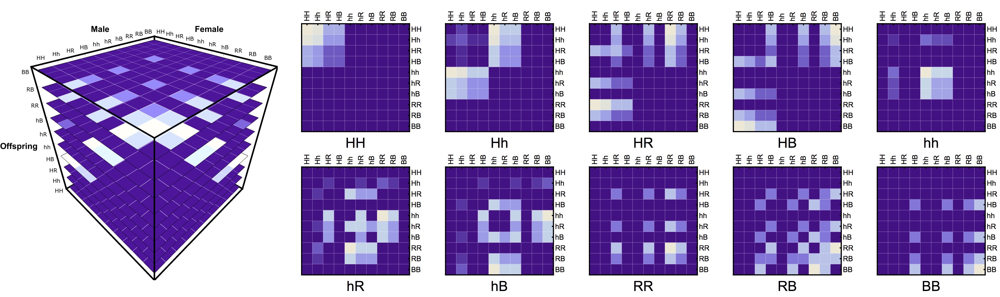
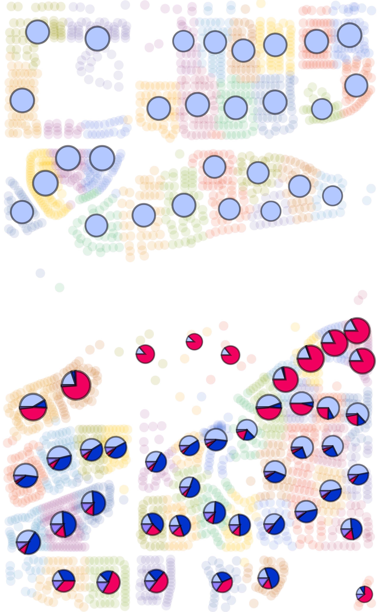

# dataPy: My Background

## Education

* Postdoc in Biostatistics and Epidemiology Department @ [University of California, Berkeley](https://www.berkeley.edu/)
* PhD in Computer Science @ [Tecnológico de Monterrey](https://tec.mx/es)
* BSc in Mechatronics Engineering @ [Tecnológico de Monterrey](https://tec.mx/es)

## [Research](https://www.researchgate.net/profile/Hector_Sanchez_Castellanos)

###  [MGDrivE](https://marshalllab.github.io/MGDrivE/): Mosquito Gene Drive Explorer (UC Berkeley)

*Dev team: One Postdoc (Computer Science) + Two PhD Students (Computational Biology & Biophysics/Biostatistics)*

###  [MoNeT](https://chipdelmal.github.io/MoNeT/): Mosquito Networks Taskforce (UC Berkeley, University of Washington, Tecnológico de Monterrey)

*Dev team: Four undergraduate students (3 Computer Science + 1 Statistics)*

###  [MASH](https://smitdave.github.io/MASH-Main/): Modular Analysis & Simulation for Health (University of Washington)

### Other Collaborations

## Teaching and Mentoring

* [Git Carpentry](https://bids.berkeley.edu/news/worldwide-audience-bids-first-spanish-language-training-workshop-introducci%C3%B3n-r-y-git)
* [dataViz CADi](https://github.com/Chipdelmal/dataViz_CADi)
* Introduction to programming (Python)
* Two masters students' thesis ([Computer Science](https://www.researchgate.net/publication/333176157_A_Novel_Deep_Recurrent_Neural_Network_Architecture_for_Time_Series_Forecasting_of_Mosquito-Borne_Disease_Case_Counts?_sg=jZF4_n21L9YfmCO7PgPPn7Ee88X_PBqApRQqUyYptj6_PeWeR8vykorJ2fi1QgUrnMy-jRJST1kMozg618oMCM-J2xJUr7T7VejCLZiK.axstZynycTAv-JL3p_u1OTEwT-wGGpDuqol9kf3HIYQEMKB1Z4zp7V_SPuO5PvlXZZtBpS55gr3Z_hrejkhWsg))
* Four undergraduate students ([3 Computer Science](https://chipdelmal.github.io/MoNeT/Berkeley.html), [1 Statistics thesis](https://www.researchgate.net/publication/333204465_Quantifying_the_Relationship_Between_Spatial_Habitat_Distribution_and_Homing_Allele_Fixation_in_MCR_Gene_Drive_Systems_for_Aedes_aegypti_Mosquitoes?_sg=-tACnujvzrgzoaxq-46SNGTWAxPXD3mRQFFdZlLuMRdutuc5aFE7jRPgihOag43L1oaGv-QykTMK2FFHwQszW0p1DRL0rZOmHDoZNg0r.wR8OXPMPnpbhrMKumT0yMmLfXQMLCz8cXRyU2LQyC5yW0HkSAn98p5hG30XMiJQLV-uIsQxOVOAb4xYCqWV_Aw))

## Interests

* Mathematical/Computational modeling of spatiotemporal processes
* Data visualization and data analysis
* Application of computational optimization techniques
* Application of engineering problem solving techniques in public health contexts

## Programming languages

* **Like:** Python, C, C++, Mathematica, Objective-C
* **Dislike:** R, Java, Javascript, Matlab, Assembly
