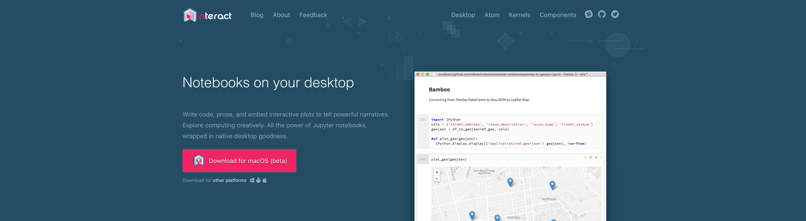
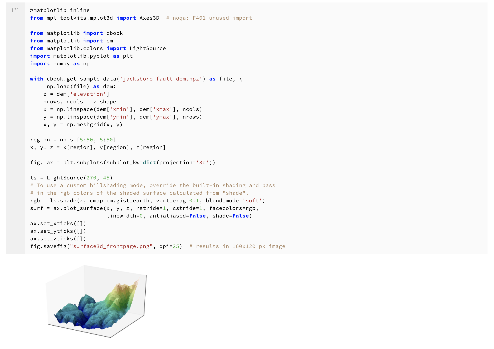

# dataPy: [nteract](https://nteract.io/desktop)

[Nteract](https://nteract.io/desktop) is a new alternative for [jupyter](https://jupyter.org/)-style code development. Using this editor is a good option for programmers who don't like coding on the internet browser (such as myself). It provides code-completion capabilities, kernel selection, it is lightweight and easy to use!




To install it, we simply download it from their [website](https://nteract.io/desktop), and click our way through the setup.



To add our environments to the kernels list we need to run the following command in our terminal:

```bash
source activate dataPy
conda install ipykernel
python -m ipykernel install        
```


##  References

* https://github.com/nteract
* https://nteract.io/desktop
