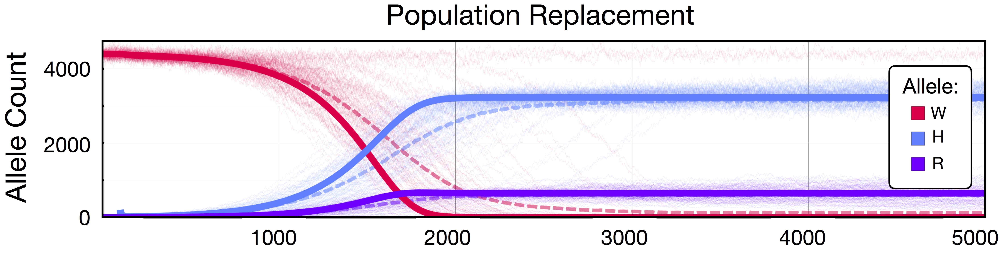

# dataPy: [numpy](https://www.numpy.org/)

[Numpy](https://www.numpy.org/) is a really powerful package that allows fast scientific computing in [python](https://www.python.org/). It allows the creation and efficient manipulation of multidimensional arrays of data, and it also provides the mathematical functions to operate upon them. [Numpy](https://www.numpy.org/) is usually installed as part of the scipy distribution, which adds functionality that makes it comparable to matlab in terms of coding and operations (both: [matlab](https://www.mathworks.com/products/matlab.html) and numpy rely on [BLAS](http://www.netlib.org/blas/) and [LAPACK](http://www.netlib.org/lapack/) for efficient linear algebra computations).

## Limitations

The major limitation of numpy is that it requires data to be homogeneous in type (integers or floats), and that arrays are not flexible in terms of growing or shrinking.

## When to use [numpy](https://www.numpy.org/)

Whenever we have layers of homogeneously-typed data that are gonna remain consistent in shape across arrays, we should use [numpy](https://www.numpy.org/) for the operations. This might sound like a pretty strict requirement, but it's actually pretty common in operations such as linear algebra, image processing, spatial analysis, signal processing, amongst others.

## [Exercise 1: pgSIT](../scripts/pgSIT.py)

##  References

* https://www.numpy.org/devdocs/user/quickstart.html
* https://en.wikipedia.org/wiki/NumPy
