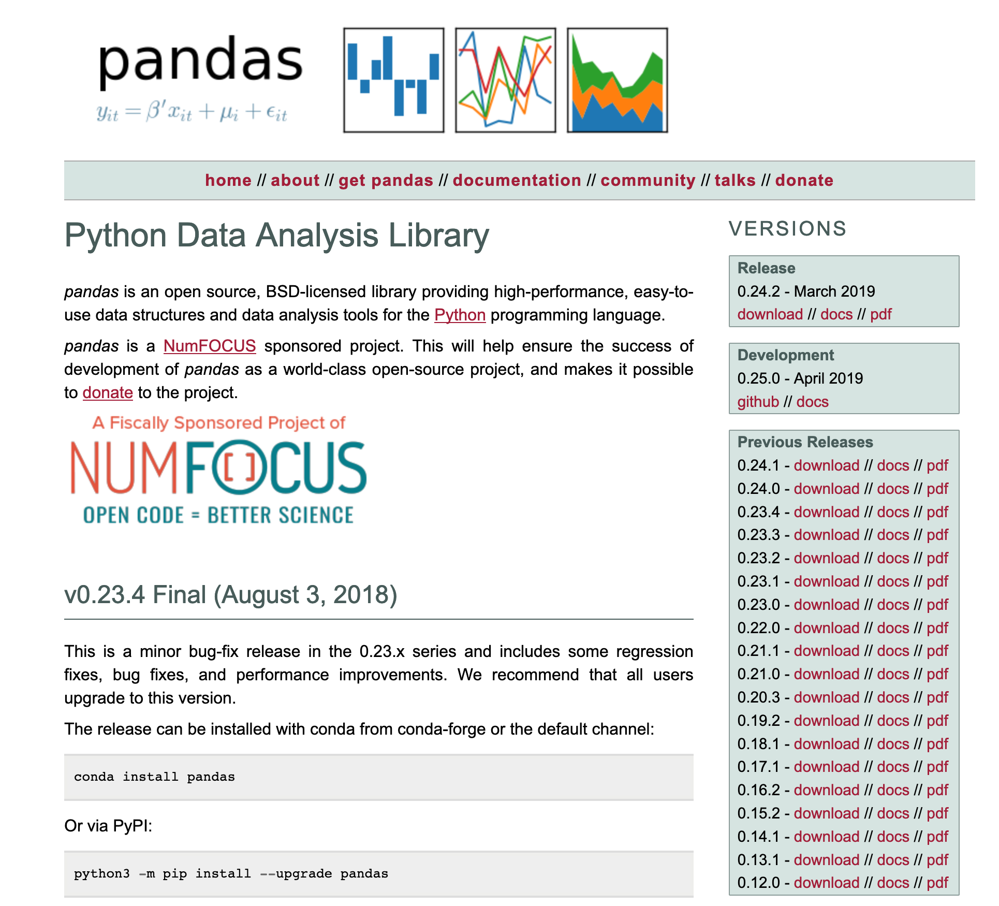
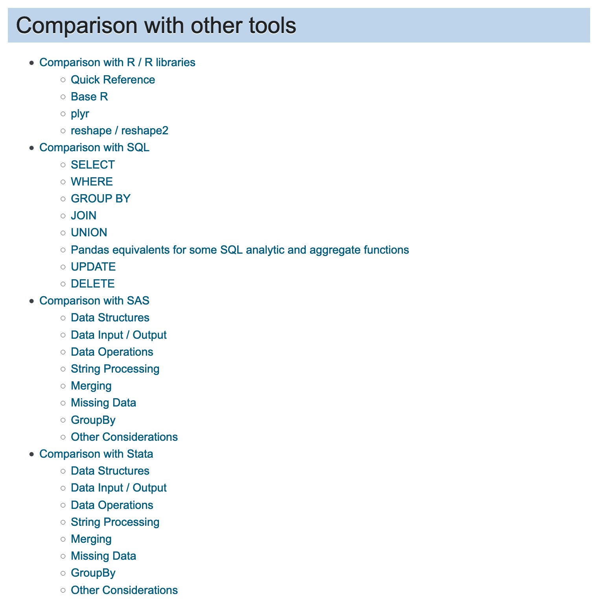
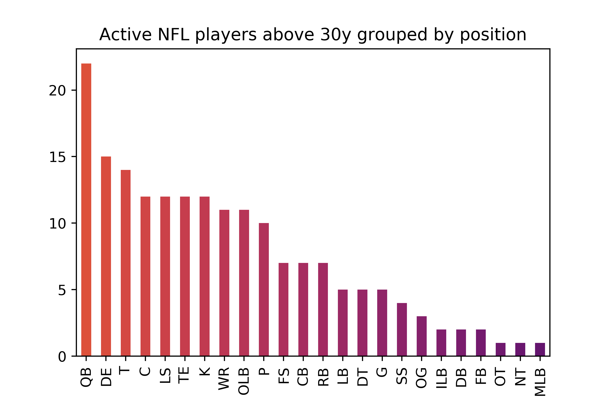
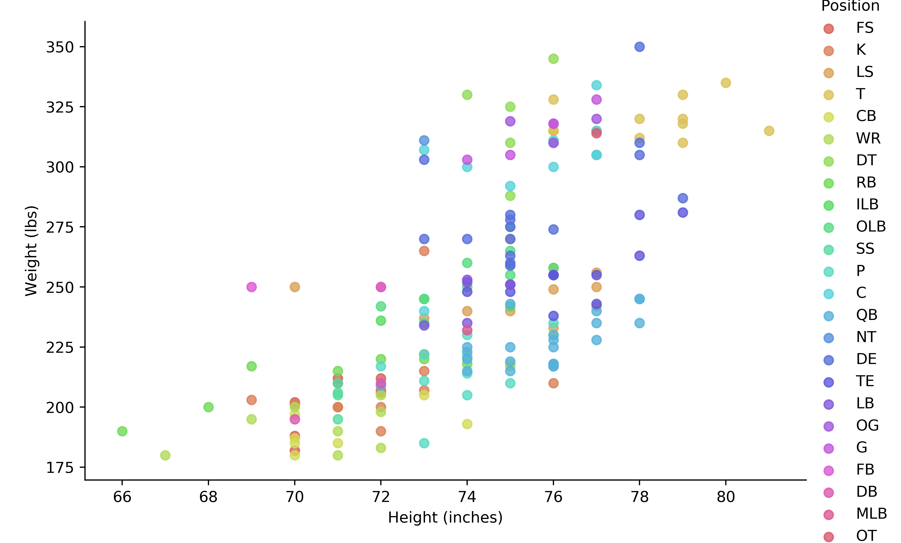
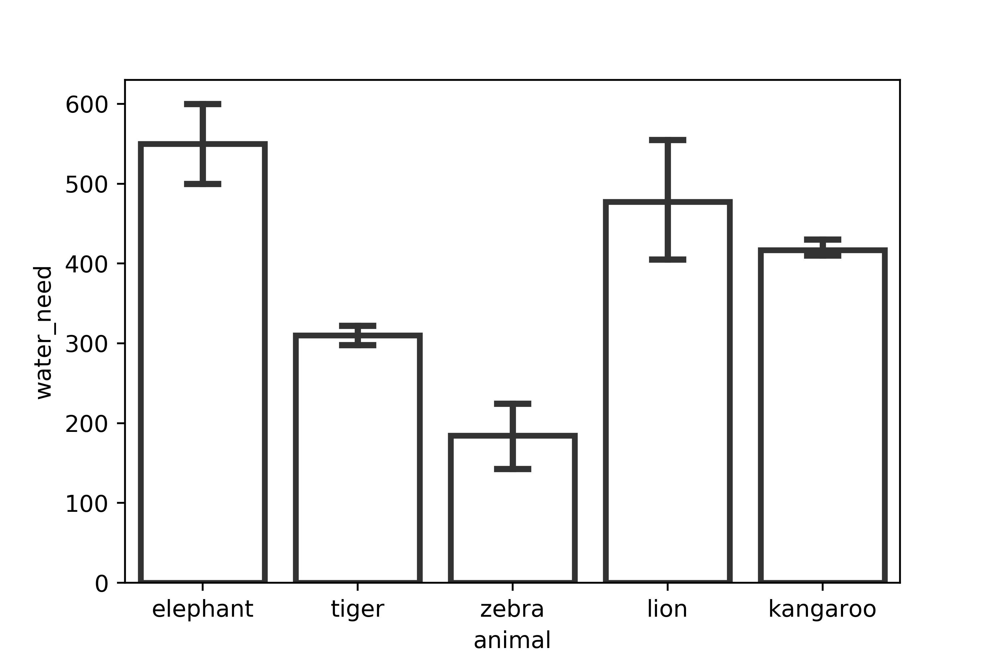
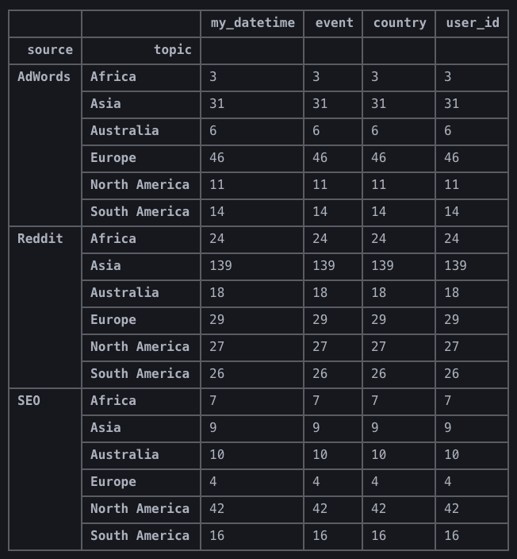
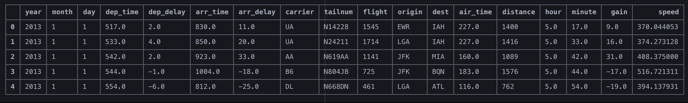
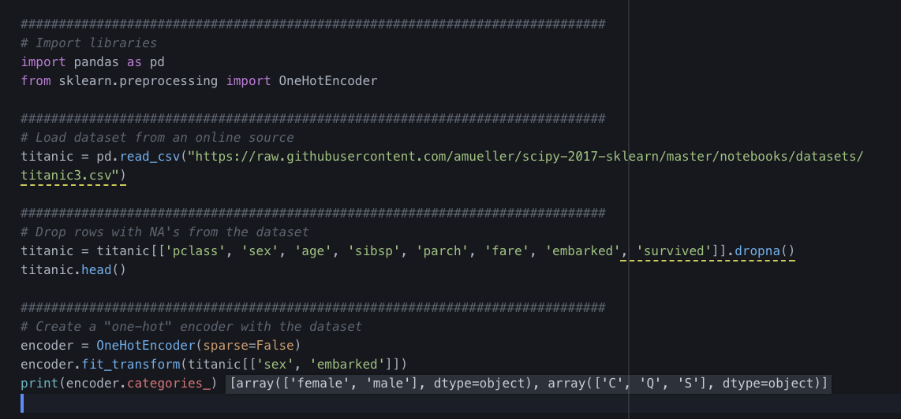
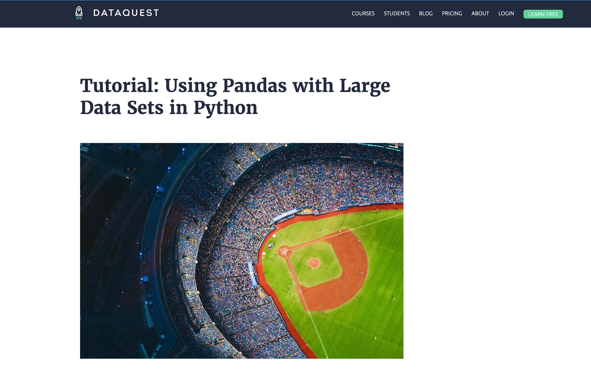
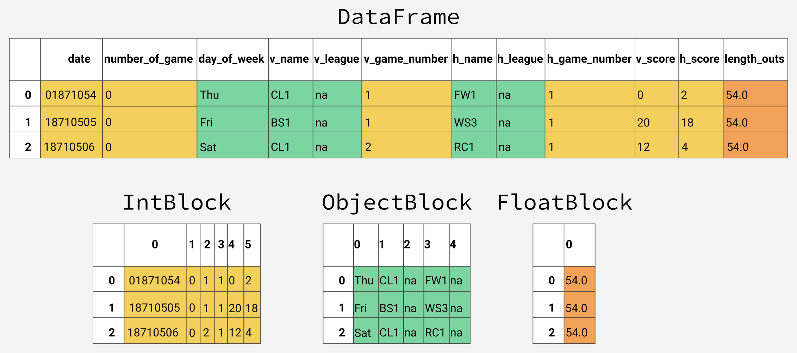

# dataPy: [pandas](https://pandas.pydata.org/)

[Data frames](https://github.com/mobileink/data.frame/wiki/What-is-a-Data-Frame%3F) are a ubiquitous tool in data analysis. In their most generic sense, they can be thought of as data records stored in a "tabular" form. This makes them ideal for most of day to day data analysis applications, as it is a pretty natural way to think about data collection. This will probably feel natural to [R](https://www.r-project.org/) programmers, but [C](https://en.wikipedia.org/wiki/C_(programming_language)) programmers might wonder what the advantages of using these structures are (in contrasts to using structures, or dictionaries). Whilst it is true that we could implement more efficient algorithms and data structures if we devote enough time to do so, we have to take a step back and think of our needs. If we are still in a data exploration stage of our project, we are probably going to need flexibility, and that's what data frames excel at. By far, the most popular tool to manipulate data frames in Python is [pandas](https://pandas.pydata.org/). It is a well documented, efficient library to manipulate data in a cohesive, consistent way.

[Pandas](https://pandas.pydata.org/)'s main strength comes from the easy of abstraction of data entries to tabular form. Most datasets can be easily thought of as collections of entries (rows) associated to categories (columns). Another main feature of the [pandas](https://pandas.pydata.org/) dataframe object is that it's highly flexible and can handle memory efficiently (for more information I highly recommend this [blog post](https://www.dataquest.io/blog/pandas-big-data/)). In contrast to [numpy](https://www.numpy.org/) arrays, dataframes can combine different data types in the same structure.

##  Exercises

### [Exercise 1: NFL](../scripts/nfl.py)

Given a dataset of NFL players containing: Age, Birth Place, Birthday, College, Current Status, Current Team, Experience, Height (inches), High School, High School Location, Name, Number, Player Id, Position, Weight (lbs), Years Played; we will be doing basic operations such as filtering and plotting of data to extract information from a data frame.

### [Exercise 2: Zoo](../scripts/zoo.py)

Another introductory exercise in which we calculate metrics from a pandas dataframe with some grouping functions.

### [Exercise 3: Articles](../scripts/articles.py)

Multiple level grouping and filtering in a small dataset.

### [Exercise 4: Flights](../scripts/flights.py)

Some more advanced filtering and grouping on pandas dataframes for statistics and metrics on a large dataset.

##  [Exercise 5: Titanic](../scripts/titanic.py)

Another exercise on filtering and plotting exercise for a simple dataset.

##  [Exercise 6: Baseball](../scripts/baseball.py)

This exercise shows how to make a more efficient use of memory in pandas, and how data are stored internally by default (https://www.dataquest.io/blog/pandas-big-data/).

##  [Exercise 7: Baseball (efficient)](../scripts/baseballOnLoad.py)

In this second part of the exercise, we will see how to do the data-efficient import of data with pandas.

##  Resources

* https://www.dataquest.io/blog/pandas-big-data/
* http://pandas.pydata.org/pandas-docs/stable/user_guide/merging.html
