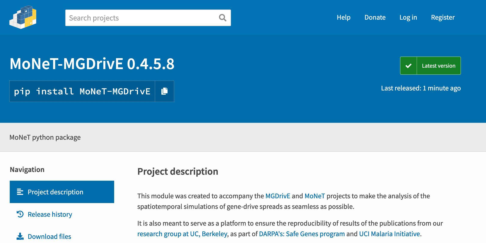

# dataPy: [Python Package](https://packaging.python.org/tutorials/packaging-projects/)

A python package involves a surprisingly low number of steps that can be found in the [official guide](https://packaging.python.org/tutorials/packaging-projects/). In this document, we'll present a summary.

## An Example: [MoNeT](https://pypi.org/project/MoNeT-MGDrivE/)

[](https://pypi.org/project/MoNeT-MGDrivE/)

<hr>

##  Creating a pip package

### Lay down the folders structure

Create the following folders and files:

```bash
/packaging_tutorial
  /example_pkg
    __init__.py
```
and edit the **__init__.py** to contain the line:

```bash
name = "example_pkg"
```

In addition to the previous folders, we will need a **README** file, and a [LICENSE](https://choosealicense.com/).

```bash
/packaging_tutorial
  /example_pkg
    __init__.py
  setup.py
  LICENSE
  README.md
```

The README file can contain any information we need in a markdown-styled file.

### Creating a **setup** script

```bash
import setuptools

with open("README.md", "r") as fh:
    long_description = fh.read()

setuptools.setup(
    name="example-pkg-your-username",
    version="0.0.1",
    author="Example Author",
    author_email="author@example.com",
    description="A small example package",
    long_description=long_description,
    long_description_content_type="text/markdown",
    url="https://github.com/pypa/sampleproject",
    packages=setuptools.find_packages(),
    classifiers=[
        "Programming Language :: Python :: 3",
        "License :: OSI Approved :: MIT License",
        "Operating System :: OS Independent",
    ],
)
```

All set! We can now install our package with the following command:

``` bash
pip install .
```

<hr>

##  [Pypi](./pypi.md) and [TestPy](https://test.pypi.org/)


### Generating distribution files

First, we need to have the latest version of [setuptools](https://pypi.org/project/setuptools/) and [wheel](https://pythonwheels.com/):

```bash
python3 -m pip install --user --upgrade setuptools wheel
```

We can now create our distribution files:

```bash
python3 setup.py sdist bdist_wheel
```

To upload our package to testpy, we must first [create an account](https://test.pypi.org/account/register/). Once we do that, we can run the following command:

```bash
python3 -m twine upload --repository-url https://test.pypi.org/legacy/ dist/*
```

### The workflow after the fist time setup

Updating the package in [TestPy](https://test.pypi.org/):

```bash
python3 setup.py sdist bdist_wheel
twine check dist/*
python3 -m twine upload --repository-url https://test.pypi.org/legacy/ dist/MoNeT_MGDrivE-0.4.5.4.tar.gz  --skip-existing
```

Updating the package in [Pypi](./pypi.md):

```bash
python3 setup.py sdist bdist_wheel
twine check dist/*
python -m twine upload dist/MoNeT_MGDrivE-0.4.5.7.tar.gz --skip-existing
```

<hr>

##  Other resources

* [Python Package](https://packaging.python.org/tutorials/packaging-projects/)
