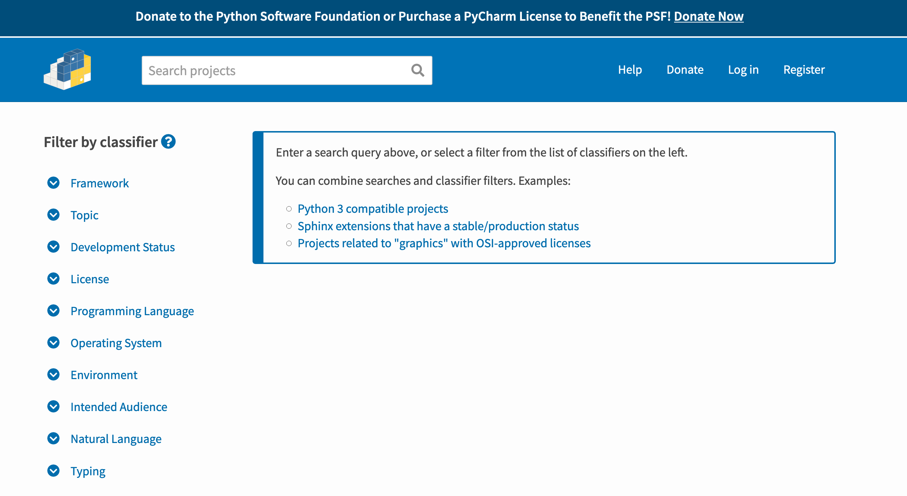

# dataPy: [pypi](https://pypi.org/)

[Python package index (pypi)](https://pypi.org/) is the largest repository for python packages (with a codebase of around 175,000+ to date). It is analogous to the [CRAN](https://cran.r-project.org/) repository for [R](https://www.r-project.org/) and it is just as easy to use once it's setup for the first time, although one of the advantages of [pypi](https://pypi.org/) over [CRAN](https://cran.r-project.org/) is the variety of areas of knowledge covered by it ([R](https://www.r-project.org/) tends to be favored mostly by stats and biology related fields).

##  Example package: [MoNeT_MGDrivE](https://pypi.org/project/MoNeT-MGDrivE/)


```bash
# To install the package
pip install MoNeT_MGDrivE
```

[](https://pypi.org/project/MoNeT-MGDrivE/)


```bash
# To uninstall it
pip uninstall MoNeT_MGDrivE
```

##  Browsing and installing packages

Browsing packages is really easy! Just head to [pypi.org](https://pypi.org/) and look for something that seems interesting!

[](https://pypi.org/search/)

Packages have link to their homepages and the installation command (which is generated automatically)

## [Creating our own package](./pkg.md)

Creating a new package is also very easy. We just need to create the following structure:

```bash
/pkg
  /dataPyPkg
    __init__.py
  setup.py
  LICENSE
  README.md
```

Let's go to the [tutorial page](./pkg.md) to go through an example.
