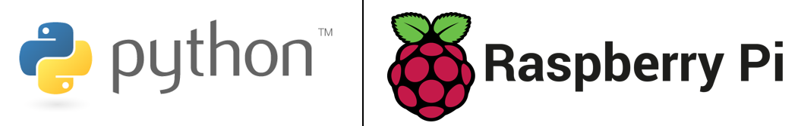

# dataPy: Python Introduction

Python is, by most accounts, the most popular *object-oriented scripting language*. There are many reasons for this, which we will look into in more detail, but in short: it is an accessible, easily readable, programming language that is extremely versatile for a wide variety of applications.

<br>

Because of these, and other reasons, Python is used in companies and applications like: Google, Dropbox, Netflix, YouTube, Raspberry Pi, amongst many others.

## Why is Python popular?

* Open source
* Flexible
* Easy to learn, yet comprehensive for complex tasks
  * Speed
  * Productivity
* Very powerful scripting language
  * Ideal for making prototypes
  * Ideal for data science
* Good code core packages
* Garbage collection
* No types definitions
* Large, friendly, community
  * Wide selection of third-party packages (pip)
  * Lots of online support for almost any kind of programming application

<br> [](https://trends.google.com/trends/explore?date=all&q=data%20science)


##  Differences with other languages

To programmers comming from other languages, Python may seem a bit strange in the beginning. Some of the main differences with other mainstream languages (such as C, C++ and Java), are:

* Indentation, not braces
* Everything is an object
* Optional arguments
* Implicit references (pointers)
* No types definitions
* Duck typing (protocols)
* Packages can be created and imported as simple files

Over time, however most programmers learn to appreciate Python's syntax and flexibility for what it is and what it is good for.


```python
def binarySearch(arr, l, r, x):
    while l <= r:
        mid = l + (r - l)/2;
        if arr[mid] == x:
            return mid
        elif arr[mid] < x:
            l = mid + 1
        else:
            r = mid - 1
    return -1
```

<hr>

##  Resources


* https://jakevdp.github.io/blog/2014/05/09/why-python-is-slow/
* https://www.geeksforgeeks.org/python-programming-examples/
* https://www.pythonforbeginners.com/code-snippets-source-code/python-code-examples
* https://treyhunner.com/2016/04/how-to-loop-with-indexes-in-python/
* [McKinney, W. Python for Data Analysis - Data Wrangling with Pandas, Numpy and Python. (2018). ISBN-13: 1491957662](https://www.amazon.com/Python-Data-Analysis-Wrangling-IPython/dp/1491957662/ref=asc_df_1491957662/?tag=hyprod-20&linkCode=df0&hvadid=312140868236&hvpos=1o1&hvnetw=g&hvrand=6431209822672155744&hvpone=&hvptwo=&hvqmt=&hvdev=c&hvdvcmdl=&hvlocint=&hvlocphy=9032076&hvtargid=pla-396828636441&psc=1)
* [Lutz, Mark, and David Ascher (2004). Learning Python. Learning. ISBN-13: 978-9351102014](http://books.google.com/books?hl=en&amp;lr=&amp;id=ftA0yk1Z92wC&amp;oi=fnd&amp;pg=PT16&amp;dq=Learning+Python&amp;ots=FzKMS8tOZC&amp;sig=2ZEqAODN6tUtsrczbwbqKeTSp60)
