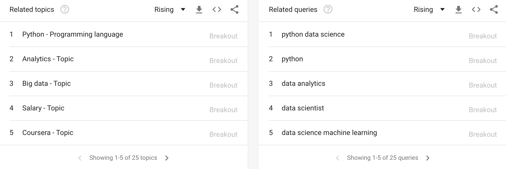

# dataPy: Python 101

Python is, by most accounts, the most popular *object-oriented scripting language*. There are many reasons for this, which we will look into in more detail, but in short: it is an accessible, easily readable, programming language that is extremely versatile for a wide variety of applications.

Because of these, and other reasons, Python is used in companies and applications like: Google, Dropbox, Netflix, YouTube, Raspberry Pi, amongst many others.

## Why is Python popular?

* Open source
* Flexible
* Easy to learn, yet comprehensive for complex tasks
  * Speed
  * Productivity
* Very powerful scripting language
  * Ideal for making prototypes
  * Ideal for data science
* Good code core packages
* Garbage collection
* No types definitions
* Large community
  * Wide selection of third-party packages (pip)
  * Lots of online support for almost any kind of programming application


[](https://trends.google.com/trends/explore?date=all&q=data%20science)

<hr>

##  Installation

Head to the [python downloads website](https://www.python.org/downloads/), and download [version 3.7.3 installer for your operating system](https://www.python.org/downloads/release/python-373/) and follow the instructions.

Additionally, let's take some time to install [Anaconda for Python 3.7](https://www.anaconda.com/distribution/), which we will be using later during the bootcamp.

<hr>

##  First Steps

For the introduction to the language, let's head to either of:
* https://www.onlinegdb.com/online_python_interpreter
* https://repl.it/

### Hello World!

```python
print("Hello World!")
```

### Types

```python
num = 10
strg = "Hello World!"
num = "test"
```

####  Numeric

####  Strings

```python
"Repeat " * 10
```


<hr>

##  Mutability


### Mutable


####  Lists

```python
# Lists
lstA = [1, 2, 3, 4]
lstA[0] = 5
print(",".join(str(e) for e in lstA))
```

```python
lstB = lstA
lstA[0] = -1

print(
  "A: [" + ",".join(str(e) for e in lstA) + "] \n" +
  "B: [" + ",".join(str(e) for e in lstA) + "]"
)
```

#### Immutable

```python
# Strings
strg = "Strings are immutable"
strg[0] = "Z"

# Tuples
tup = (1,2)
```

<hr>

### Functions

```python
def lstToStr(inList):
  converted = ",".join(str(e) for e in inList)
  return "[" + converted + "]"
```
