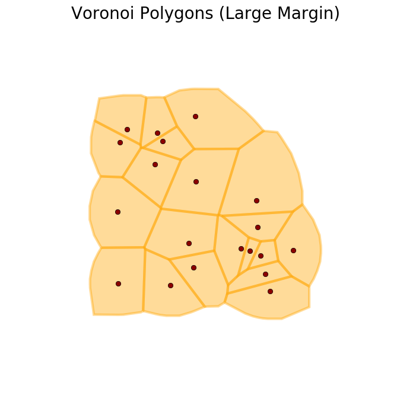
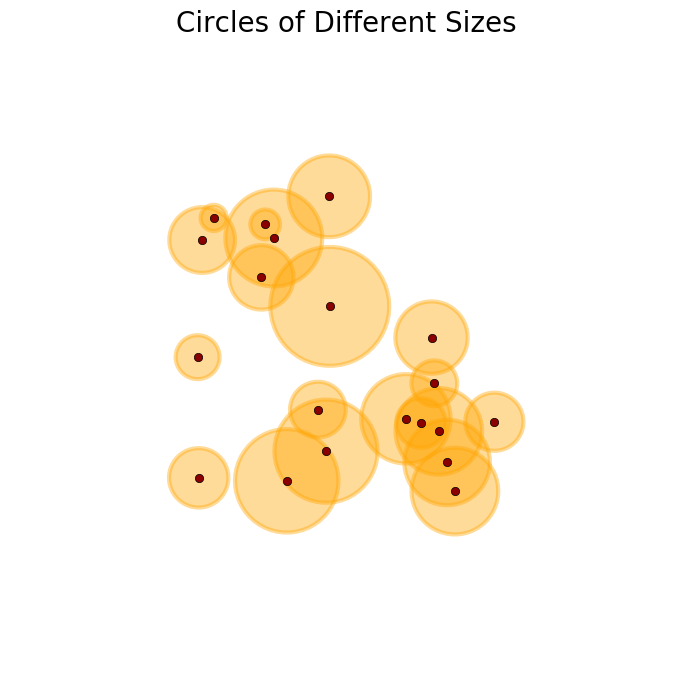
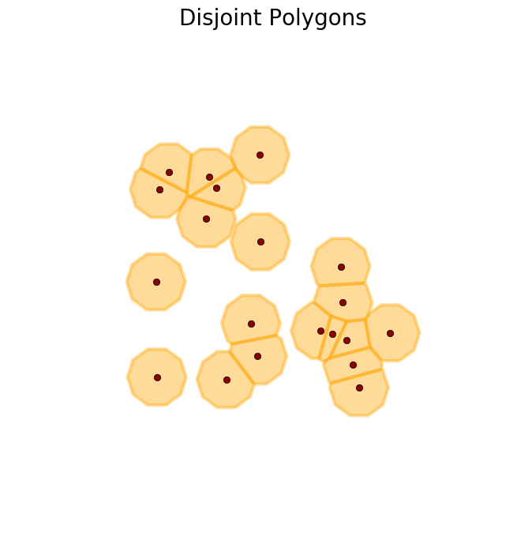

# dataPy: Python 101 (part 2)

For the second part of the Python introduction, let's install Python in our systems (or update it), along with Anaconda (which we will use later in the bootcamp). With our installations in place, we will explore some deeper concept we will require throughout the course.

<hr>

##  Installation

Head to the [python downloads website](https://www.python.org/downloads/), and download [version 3.7.3 installer for your operating system](https://www.python.org/downloads/release/python-373/) and follow the instructions.

Additionally, let's take some time to install [Anaconda for Python 3.7](https://www.anaconda.com/distribution/), which we will be using later during the bootcamp.

To check that our python distribution was correctly installed, let's run the following command in the terminal:

```bash
python --version
```

It should return **Python 3.7.x**.

<hr>

##  Data Structures

This is not a CS data structures course, nevertheless, it is important to understand how data is stored in python so that we can manipulate it as we desire.

### List

Lists are the most widely used structure in python. These are sequences of elements that can be replaced, extended, reduced in size, amongst other operations.

```python
# We can create and
lstA = [1, 2, 3, 4]
lstA[0] = 5
print(lstA)
```

Same as in programming languages as Mathematica and R, we can "slice" elements of lists easily in python:

```python
# Getting elements through indices
a = [7, 1, 2, 6, 0, 3, 2]
a[2:4]
# Replacing elements
a[2:3] = [0,0]
# Getting elements from the end
a[-2]
```

####  Add, Remove and Combine

As mentioned before, lists are mutable, meaning that they can be modified easily:

```python
a = ["a","b","c"]
# Adding an element to the list
a.append("x")
# Inserting an element in a position and shifting the following ones
a.insert(1,"y")
# Removing and returning the head of the list
a.pop(0)
# Removing and returning the tail of the list
a.pop(-1)
# Removing an element of the list by value
a.remove("b")
# Concatenating lists (slow)
x = ("l","m","n")
b = a + x
# Extending a list (fast)
a.extend(x)
a
```

####  Sorting and Searching

Finding an element in a list is easy (albeit computationally expensive):

```python
[0,0,0,1,2,3].index(2)
```

Lists can be sorted in place:

```python
a = ['y', 'c', 'lx', 'maa', 'n', 'l', 'm', 'nzzz']
a.sort()
a.sort(key=len)
```

We can also insert elements whilst keeping the list sorted with **bisect**:

```python
import bisect as bs
c = [1,2,2,2,3,4,5,8]
# To return the position:
pos = bs.bisect(c,3)
# To do the sorted insertion
bs.insort(c,3)
```

####  Warning!

One important thing to take into account, is that when we assign the list to another variable, we are pointing towards the same original list (no copy is automatically created), so if we modify the contents of either of the references, we will modify the contents of the structure in memory:

```python
lstA = [1, 2, 3, 4]
lstB = lstA
lstA[0] = -1
print(lstB, lstA)
```
To avoid this, when assigning the second reference, we can explicitly create a copy of the contents:

```python
lstA = [1, 2, 3, 4]
lstB = lstA.copy()
lstA[0] = -1
print(lstB, lstA)
```


### Dictionary

A dictionary is not a sequence of elements, but rather a "mapping". This means that rather than storing elements in a given order, the dictionary stores pairs of: **key-value**. For CS people, a dictionary is, an implementation of a mutable hash table.

```python
# We can create a dictionary in various different ways:
dictEx = {"age": 10 , "name": "Pusheen", "animal": "cat"}
dictEx = dict(name="Pusheen", animal="cat", age=10)
dictEx = dict(zip(["name","age","animal"],["Pusheen",10,"cat"]))
dictEx["age"]
# We can also add a new element by key, or replace an existing one
dictEx["age"] = 11
dictEx["hobby"] = "blogging"
dictEx
# We could print the contents of the dictionary by sorted key using a list comprehension:
[i + " is " + str(dictEx[i]) for i in sorted(dictEx.keys())]
```


### Tuples

Tuples, store a sequence of elements but, unlike lists, they are immutable (meaning that, once created, we can't modify them).

```python
# We can't modify the contents of a tuple once it's created
a = (1,2,0,4,5)
a[2] = 3
# We can, however, concatenate tuples
b = a + a
b
```


### Set

A set is, as its mathematic counterpart, an unordered collection of unique elements. It support operations such as union, intersection, difference, and symmetric difference. These structures are specially useful to check if an element has already been visited in a traverse algorithm, or to get the unique elements in a structure.

```python
a = set([1,3,3,2,2,4,4,4,4,0])
b = set([2,2,3,3,9])
# Union
a & b
# Instersection
a | b
```

[](http://ric70x7.github.io/20190121_buffers.html)[](http://ric70x7.github.io/20190121_buffers.html)[](http://ric70x7.github.io/20190121_buffers.html)

<hr>

## Files

File objects are interfaces to files in Python. Reading and writing files in Python is not that different from other object-oriented languages such as **C++** or **Java**:

```python
f = open("../data/extracted/1984/1984.txt")
text = f.read()
text.count('\n')
```


<hr>

##  Resources

* [McKinney, W. Python for Data Analysis - Data Wrangling with Pandas, Numpy and Python. (2018). ISBN-13: 1491957662](https://www.amazon.com/Python-Data-Analysis-Wrangling-IPython/dp/1491957662/ref=asc_df_1491957662/?tag=hyprod-20&linkCode=df0&hvadid=312140868236&hvpos=1o1&hvnetw=g&hvrand=6431209822672155744&hvpone=&hvptwo=&hvqmt=&hvdev=c&hvdvcmdl=&hvlocint=&hvlocphy=9032076&hvtargid=pla-396828636441&psc=1)
* [Lutz, Mark, and David Ascher (2004). Learning Python. Learning. ISBN-13: 978-9351102014](http://books.google.com/books?hl=en&amp;lr=&amp;id=ftA0yk1Z92wC&amp;oi=fnd&amp;pg=PT16&amp;dq=Learning+Python&amp;ots=FzKMS8tOZC&amp;sig=2ZEqAODN6tUtsrczbwbqKeTSp60)
