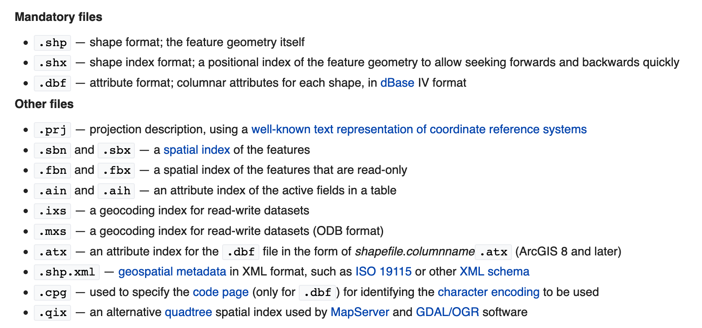
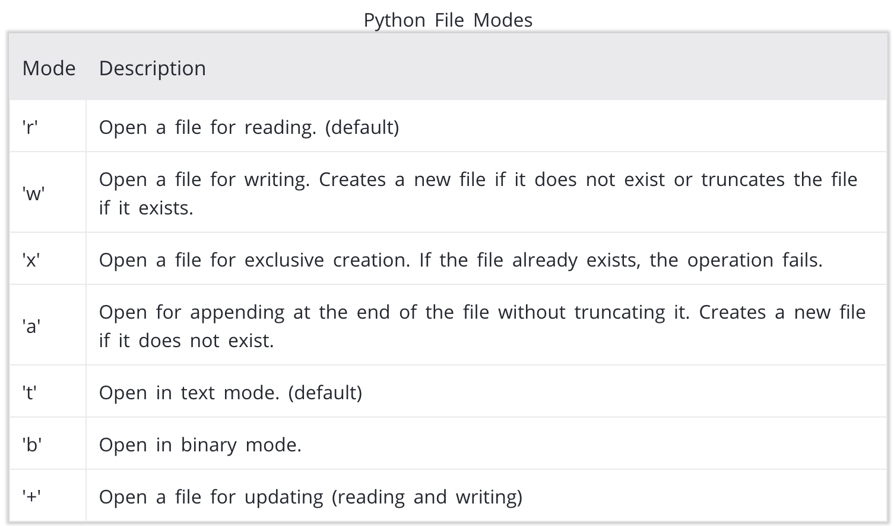

# dataPy: Python 102


<hr>

## File Formats

Data wrangling inherently involves loading and writing data to disks. Fortunately, python has a lot of tools to do these operations as seamlessly as possible!

### [CSV/TSV](https://en.wikipedia.org/wiki/Comma-separated_values)

Most prevalent data format. Stores information in a tabular way in which each slot in an entry is separated by a comma, "tab" or by a custom separator symbol; and each entry is a row in the plain text file.

The main drawback of CSV is its lack of support for highly structured data/different levels of aggregation.

```
Patch,WH,WR,WB,HH,HR,HB,RR,RB,BB
1,25,0,0,0,0,0,0,0,0
2,24.47,0,0,0,0,0,0,0,0
3,24.48,0,0,0,0,0,0,0,0
4,24.36,0,0,0,0,0,0,0,0
5,24.43,0,0,0,0,0,0,0,0
6,24.44,0,0,0,0,0,0,0,0
7,24.35,0,0,0,0,0,0,0,0
8,24.23,0,0,0,0,0,0,0,0
9,24.38,0,0,0,0,0,0,0,0
10,24.27,0,0,0,0,0,0,0,0
...
20,25.53,0,0,0,0,0,0,0,0
21,25.48,0,0,0,0,0,0,0,0
22,25.62,0,0,0,0,0,0,0,0
```

A basic CSV reading example follows:

```python
import csv
csvfile = open('data-text.csv', 'rb')
reader = csv.DictReader(csvfile)
	for row in reader:
		print row
csvfile.close()
```


### [XML](https://en.wikipedia.org/wiki/XML)

It's main goal is to create a documents markup language that is readable for both: humans and computers. Despite it being designed for documents, it is widely used for data-storage.

XML's main criticisms stem from two main branches: it's extreme verbosity (which leads to large file sizes), and the difficulty to store "unravel" the tree of the data to share across applications.

```
<experiment>
	<header>
		<title>Novel Control Measures.</title>
		<author>HMSC</author>
		<date>09:51:08.060 PM 22-Jun-2016</date>
		<description>Replicating RIDL/Wolbachia papers in smaller scale.</description>
	</header>
	<parameters>
		<parameter id="SecondsPerTick">300</parameter>
		<parameter id="ScenarioNumber">GMap</parameter>
		<parameter id="Temperature">25</parameter>
		<parameter id="BreedingZonesNumber">GoogleMap</parameter>
		<independent id="HUMAN_VISITING_PROBABILITY">2.88E-4</independent>
	</parameters>
	<ticks_outputs>
		<tick id="28944">
			<output id="MosquitoPopulation">3765</output>
			<output id="EggsPopulation">2833</output>
			<output id="LarvaPopulation">395</output>
			<output id="PupaPopulation">88</output>
			<output id="AdultPopulation">449</output>
			<output id="WolbachiaPopulation">0</output>
			<output id="SterilePopulation">0</output>
			<output id="FitnessPopulation">0</output>
			<output id="OxitecPopulation">0</output>
			<output id="EggDeathByInhibition">0.01005041875439575</output>
			<output id="LarvaDeathByDensity">9.398346146001782E-4</output>
			<output id="Temperature">25</output>
			<output id="FemalePopulation">197</output>
		</tick>
    ...
   </ticks_outputs>
</experiment>
```

### [JSON](https://en.wikipedia.org/wiki/JSON)

Human-readable data transmission format based on "attribute-value" pairs and arrays (or serializable formats) to store data.

```
[{
  "id": [2],
  "tile": [1],
  "time": [0, 0, 0],
  "sites": [34, 54, 54],
  "search": [true, false, false],
  "behavior": ["B", "B", "D"],
  "cod": ["surviveFlight"],
  "bloodHosts": [0],
  "timeFeed": [0],
  "siteFeed": [0],
  "probeAndFeed": [false],
  "ovipositionTimes": [0],
  "ovipositionSites": [0],
  "ovipositionBatchSize": [0]
},
...
{
  "id": [45],
  "tile": [1],
  "time": [0, 0.4553, 0.4553, 0.4553],
  "sites": [4, 34, 31, 31],
  "search": [true, true, false, false],
  "behavior": ["B", "B", "B", "D"],
  "cod": ["surviveFlight"],
  "bloodHosts": [0],
  "timeFeed": [0],
  "siteFeed": [0],
  "probeAndFeed": [false],
  "ovipositionTimes": [0],
  "ovipositionSites": [0],
  "ovipositionBatchSize": [0]
}]
```

A python example of how to read these kinds of data is:

```python
import json
json_data = open('data-text.json').read()
data = json.loads(json_data)
	for item in data:
		print item
json_data.close()
```

### [Shapefile](https://en.wikipedia.org/wiki/Shapefile)

This file format was designed to handle polygonal data for [geographic information systems (GIS)](https://www.esri.com/en-us/what-is-gis/overview). The specification contains at least three mandatory files, and several optional ones:

[](https://en.wikipedia.org/wiki/Shapefile)

### Other data types

One of the main advantages of using python is that it has great diversity in packages and libraries that allow us to handle almost any common filetype.

```python
import xlrd
book = xlrd.open_workbook('excelFile.xlsx')
	for sheet in book.sheets():
		print sheet.name
```

<hr>

## File Connections

One way to open files in Python is by manually opening and closing the connection to disk:

```python
txtFile = open('../data/extracted/ioTest.csv','w')
txtFile.write("Testing output of text")
txtFile.close()
```

This, however, is slightly unsafe. If an exception is raised in our code, the connection will not be guaranteed to close correctly. A better approach is:

```python
try:
	txtFile = open('../data/extracted/ioTest.csv','w')
	txtFile.write("Testing output of text")
finally:
  txtFile.close()
```

This ensures that the connection is closed in case an exception is raised in our code. The third, and the best way to do it in python, is to use a **with** block:

```python
import csv
with open("../data/extracted/tweepy/crispr.csv","r") as csvfile:
    readCSV = csv.reader(csvfile, delimiter=',')
    for row in readCSV:
        print(row)
```

[](https://www.geeksforgeeks.org/reading-writing-text-files-python/)

Throughout this course, however, we are mostly going to use functions that are built-in in packages to both load, and store data.


<hr>

##  Storing Objects


###	[Pickle](https://docs.python.org/3/library/pickle.html)

[Pickle (pkl)](https://www.datacamp.com/community/tutorials/pickle-python-tutorial) is a serialized data format exclusive to python that is capable of storing objects in a compressed form for sharing or storing. This is useful not only for storage, but for data transmission.


```python
import pickle
objectOut = {"a": 1, "b": 2}
file = open('../data/extracted/dataDump/filename_pi.obj', 'wb')
pickle.dump(objectOut, file)
file_pi.close()
```

we can, in the same or in a different session, load the data without any hassle:

```python
file = open('../data/extracted/dataDump/filename_pi.obj', 'rb')
objectIn = pickle.load(file)
file.close()
```

Let's make sure they contain the same information:

```python
print(objectIn == objectOut)
```

Finally, we can also take a quick look at the documentation of the methods:

```python
help(pickle.dump)
help(pickle.load)
```

To [R](https://www.r-project.org/) programmers this might seem familiar. This process is similar to storing objects in [**RDS**](http://www.sthda.com/english/wiki/saving-data-into-r-data-format-rds-and-rdata) files.


Whilst extremely useful and simple, pickle has its downsides. Specifically, sharing **pkl** files across programming languages is nor feasible. Additionally using these files across python versions might have unintended behaviours and special care should be taken when loading **pkl** files from untrusted sources, as it can contain malicious code.


### [JSON](https://docs.python.org/3/library/json.html)

```python
import json
objectOut = {"a": 1, "b": 2}
parsed = json.dumps(objectOut)

```

<hr>

##	[Parallel Computing (Map)](https://www.datacamp.com/community/tutorials/pickle-python-tutorial)

Whilst it is outside of the scope of this bootcamp to go into the intricacies of parallel computing, it is worth noting that it is possible and simple in most cases paralellize the computation of simple functions:

```python
import multiprocessing as mp
from math import cos

p = mp.Pool(2)
p.map(cos, range(10))
```

For lambda (anonymous) functions:

```python
import pathos.multiprocessing as mp

p = mp.Pool(2)
p.map(lambda x: 2**x, range(10))
```

<hr>


##  Resources

* https://www.datacamp.com/community/tutorials/pickle-python-tutorial
* https://www.geeksforgeeks.org/reading-writing-text-files-python/
* https://www.thoughtco.com/using-pickle-to-save-objects-2813661
* https://www.programiz.com/python-programming/file-operation
* [Matthes, E. (2016). Python Crash Course - A Hands-On, Project-Based Introduction to Programming. No Starch Press.](https://www.amazon.com/Python-Crash-Course-Project-Based-Introduction/dp/1593276036)
