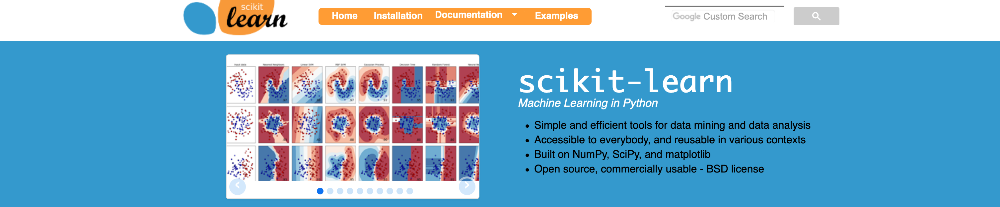
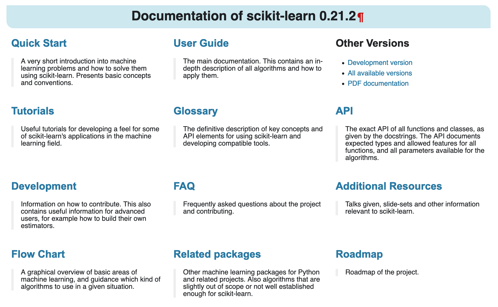
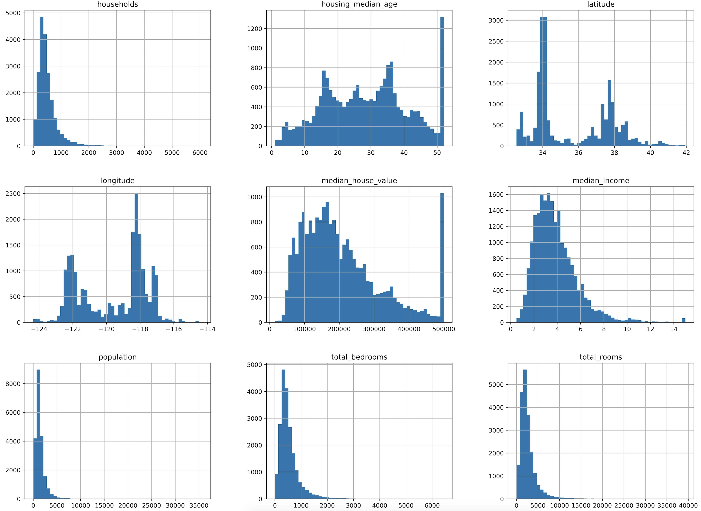
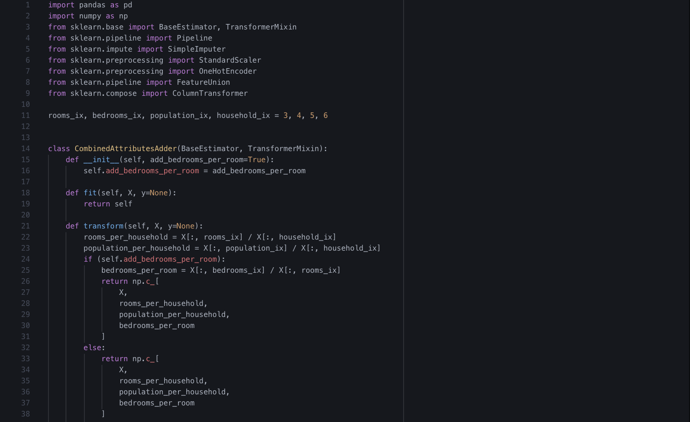

# dataPy: [scikit-learn](https://scikit-learn.org/stable/)

[Scikit-Learn](https://scikit-learn.org/stable/) is a machine learning package for Python. This is an extremely robust distribution that contains algorithms to do [supervised](https://scikit-learn.org/stable/supervised_learning.html#supervised-learning) and [unsupervised](https://scikit-learn.org/stable/unsupervised_learning.html#unsupervised-learning) learning.

This library is widely used and thoroughly [documented](https://scikit-learn.org/stable/documentation.html), with [tutorials](https://scikit-learn.org/stable/tutorial/index.html) available both as **.py** scripts and [jupyter](https://jupyter.org/) notebooks.

In terms of this bootcamp, however, we will focus on its [data preprocessing capabilities](https://scikit-learn.org/stable/modules/preprocessing.html#preprocessing). We will use some of the tools available to clean, impute, and create pipelines that allow us to automate much of the pruning of data to a usable state for machine learning applications.

##  Exercises

### [Exercise 1: "California Housing (Cleaning)"](../scripts/housingCleaning.py)

In this exercise, we will focus on loading a dataset into a [pandas](./pandas.md) dataframe, and performing an initial exploration through basic [matplotlib plots](./matplotlib.md).

### [Exercise 2: "California Housing (Exploring)"](../scripts/housingExploring.py)

The second part of the exercise involves the use of [scikit-learn](./scikitLearn.md) to impute data and pre process it for machine learning applications.

### [Exercise 3: "California Housing (Transforming)"](../scripts/housingTransforming.py)

The third part of the exercise will show us how to define classes to work with pipelines in [scikit-learn](https://scikit-learn.org/stable/) so that we can automate the data-cleaning process.

##  Resources

* https://scikit-learn.org/stable/modules/preprocessing.html#preprocessing
* https://scikit-learn.org/stable/index.html
* https://scikit-learn.org/stable/documentation.html
* https://scikit-learn.org/stable/tutorial/index.html
