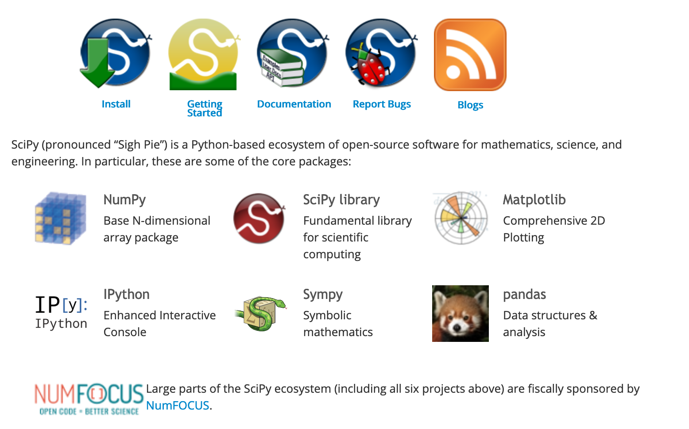

# dataPy: [SciPy](https://www.scipy.org/)

[SciPy](https://www.scipy.org/) is a compendium of packages curated for scientific applications. Currently, this package contains: [Numpy](https://docs.scipy.org/doc/numpy/), [Matplotlib](https://matplotlib.org/contents.html), [IPython](http://ipython.org/ipython-doc/stable/index.html), [SymPy](https://docs.sympy.org/latest/index.html), and [Pandas](http://pandas.pydata.org/pandas-docs/stable/); on top of some additional [SciPy](https://www.scipy.org/) routines (such as: optimization, linear algebra, integration, interpolation, special functions, FFT, signal processing, image processing, ODE solvers, amongst others).

