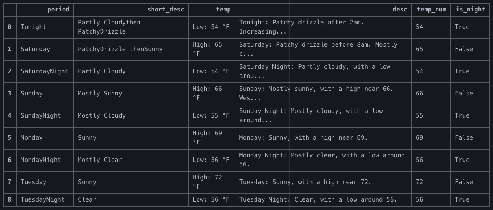

# dataPy: Web Scrapping

Web-scraping refers to the coding activity of automating the download of data from websites through a web crawler. This process usually involves at least three steps: downloading the webpage, extracting the required information from its HTML structure, and cleaning it for further use. As such, it can be somewhat tedious if not done properly.

 

As this is a pretty common programming task (specially for businesses), there are packages for us to automate these processes. The main web scraping tools for python are [BeautifulSoup](https://pypi.org/project/beautifulsoup4/) and [Scrapy](https://scrapy.org/). In general terms, [BeautifulSoup](https://pypi.org/project/beautifulsoup4/) is favored for simple tasks, whilst [Scrapy](https://scrapy.org/) is more flexible and comprehensive (for a more thorough comparison, please look at this [DataCamp post](https://www.datacamp.com/community/tutorials/making-web-crawlers-scrapy-python)).

## [BeautifulSoup](https://pypi.org/project/beautifulsoup4/)

For most everyday crawling applications, [beautifulsoup](https://pypi.org/project/beautifulsoup4/) is likely to be the best alternative due to its [simplicity](https://www.crummy.com/software/BeautifulSoup/bs4/doc/#kinds-of-objects)) and [documentation](https://www.crummy.com/software/BeautifulSoup/bs4/doc/).

## [Scrapy](https://scrapy.org/)

For more advanced applications such as: high volume datasets, proxies, time-sensitive data parsing; [scrapy](https://scrapy.org/) is the most robust option available. This, however, comes at a cost. Despite its thorough [documentation](https://docs.scrapy.org/en/latest/), [scrapy](https://scrapy.org/) is substantially more difficult to learn so it's probably best left to applications that really require its use.

## Exercises

###  [Exercise 1: 7-Day Forecast](../scripts/soup.py)

This exercise will teach us how to download the information from: https://forecast.weather.gov/; and download the seven day forecast into a pandas dataframe.

##  References

* https://www.dataquest.io/blog/tutorial-text-classification-in-python-using-spacy/
