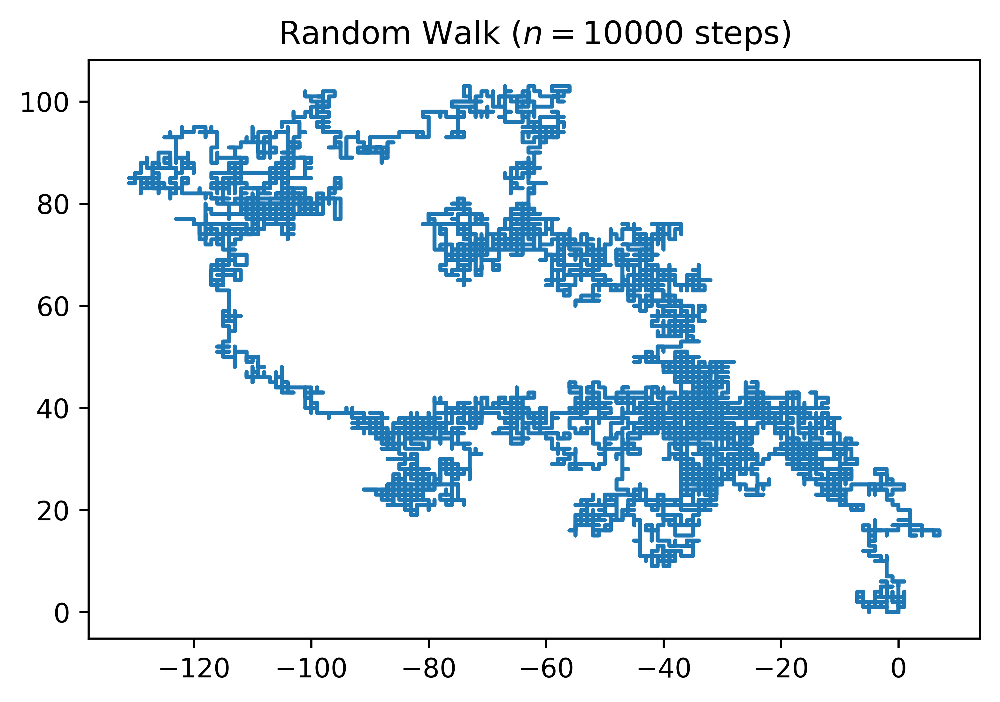

# [Spyder](https://www.spyder-ide.org/)

A good option for people comfortable with [RStudio](https://www.rstudio.com/). This IDE mimics [R](https://www.r-project.org/)'s most popular coding environment and makes its functionalities available to Python programmers.


##  Installation

To install [Spyder](https://www.spyder-ide.org/) in our [Anaconda](https://www.anaconda.com/) environment, we can do the following in the terminal:

```bash
source activate dataPy
conda install spyder
conda deactivate
```

Or we can install it from the [Anaconda](https://www.anaconda.com/) GUI.

##  Launching a Session

```bash
source activate dataPy
spyder
```

## [Exercise 01: Random Walk in Spyder](../scripts/spyder.py)

In this exercise, we will create a two-dimensions random walk in [Spyder](https://www.spyder-ide.org/) to get an idea of how the IDE can be used for scientific applications.


