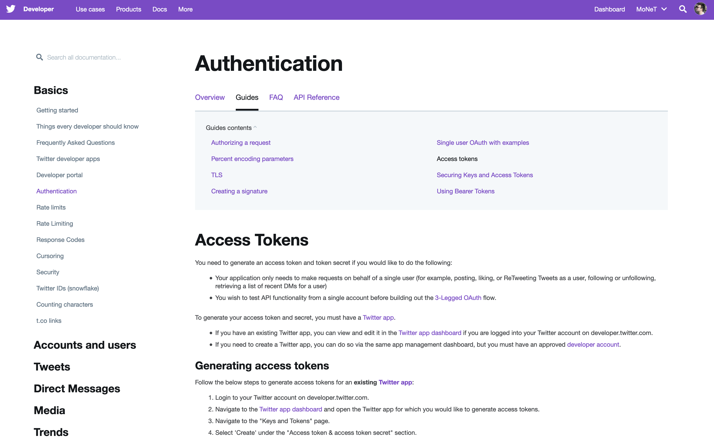

# dataPy: Twitter

Twitter is a very valuable source of news and information. With around 25 million users worldwide, it makes sense to try to make use of the information shared
##  [Twitter API](https://developer.twitter.com/en/docs.html)

Twitter's API (Application Programming Interface)

[](https://developer.twitter.com/en/docs.html)

### [Setting up the credentials](https://developer.twitter.com/en/apps/16139502)

1. [Developer account](https://developer.twitter.com/en/apply)
2. [App Dashboard](https://developer.twitter.com/en/apps)
3. [Keys and Tokens](https://developer.twitter.com/en/apps)

[](https://developer.twitter.com/en/docs.html)

<hr>

##  Python Packages

Fortunately, we don't need to worry creating our own implementation necessary for the communication with the twitter API. Several packages exist to make this common task easy and accessible for us as developers/researchers.

###  [Tweepy](https://www.tweepy.org/)

Tweepy is a Python wrapper for making common tasks in the Twitter API accessible and easy to use. It is fully [documented](https://tweepy.readthedocs.io/en/latest/index.html) and it has community support that share [examples](https://stackabuse.com/accessing-the-twitter-api-with-python/) and help.

Installing tweepy is extremely simple with its [pypi package](https://pypi.org/project/tweepy/):

```bash
source activate dataPy
pip install tweepy
conda deactivate
```

Once installed, we can move on to some [exercises](../scripts/tweepyDemo.py).


### [Python Twitter Tools](https://github.com/sixohsix/twitter)

```bash
source activate dataPy
pip install twitter
conda deactivate
```

### [Other Python Packages for Twitter](https://stackabuse.com/accessing-the-twitter-api-with-python/)

Some of the alternatives to tweepy are:

* [Twython](https://github.com/ryanmcgrath/twython)
* [Python-twitter](https://github.com/bear/python-twitter)


## Other Sources

* https://stackabuse.com/accessing-the-twitter-api-with-python/
* https://www.pythoncentral.io/introduction-to-tweepy-twitter-for-python/
* https://gist.github.com/vickyqian/f70e9ab3910c7c290d9d715491cde44c
* https://gist.github.com/dev-techmoe/ef676cdd03ac47ac503e856282077bf2
* http://docs.tweepy.org/en/v3.5.0/cursor_tutorial.html
