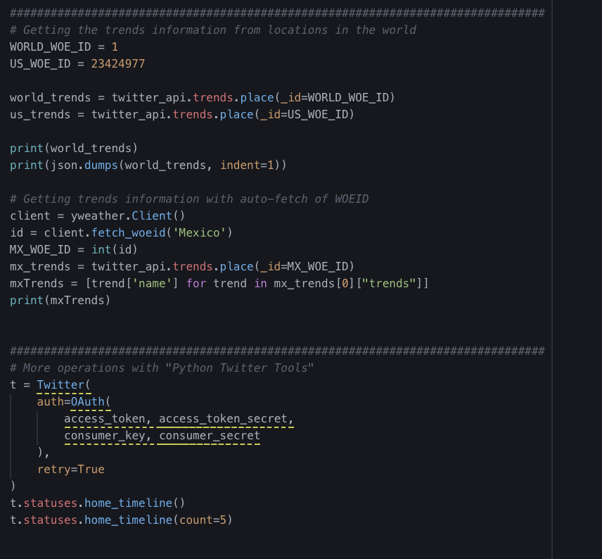
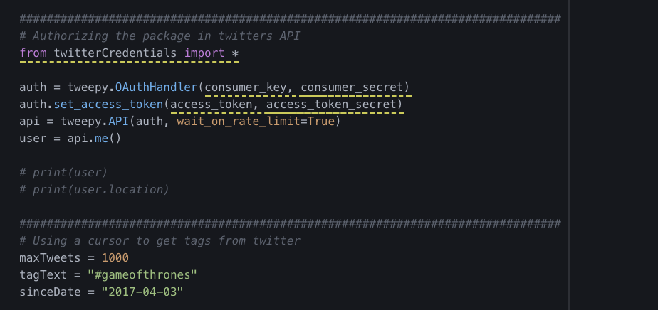
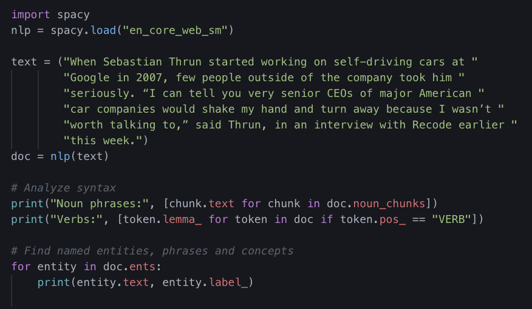
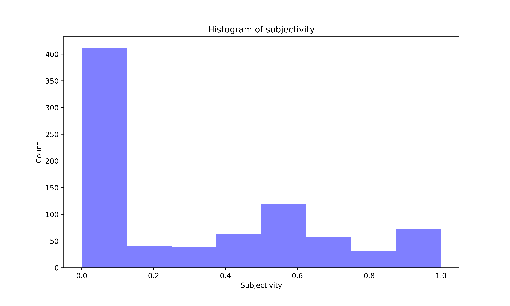
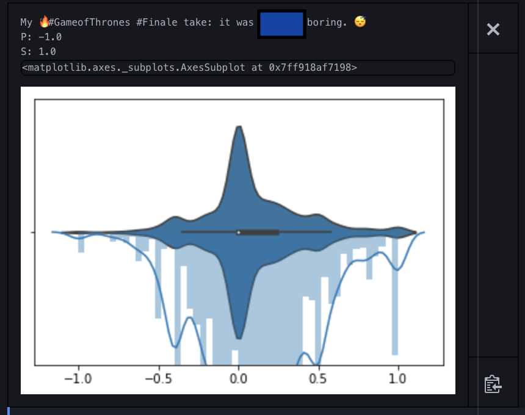

# dataPy: Twitter

Twitter is a very valuable source of news and information. With around 25 million users worldwide, it makes sense to try to make use of the information shared on it. Fortunately, there are some Python interfaces to help us do just that.

To get started, we need to setup a developer account and generate a request for an "app" to access the API. Once done that, we can use our app's keys and tokens to parse the information.

##  [Twitter API](https://developer.twitter.com/en/docs.html)

Twitter's API (Application Programming Interface)

[](https://developer.twitter.com/en/docs.html)

### [Setting up the credentials](https://developer.twitter.com/en/apps/16139502)

1. [Developer account](https://developer.twitter.com/en/apply)
2. [App Dashboard](https://developer.twitter.com/en/apps)
3. [Keys and Tokens](https://developer.twitter.com/en/apps)

[](https://developer.twitter.com/en/docs.html)

<hr>

##  Python Packages

Fortunately, we don't need to worry creating our own implementation necessary for the communication with the twitter API. Several packages exist to make this common task easy and accessible for us as developers/researchers.

###  [Tweepy](https://www.tweepy.org/)

Tweepy is a Python wrapper for making common tasks in the Twitter API accessible and easy to use. It is fully [documented](https://tweepy.readthedocs.io/en/latest/index.html) and it has community support that share [examples](https://stackabuse.com/accessing-the-twitter-api-with-python/) and help.

Installing tweepy is extremely simple with its [pypi package](https://pypi.org/project/tweepy/):

```bash
source activate dataPy
pip install tweepy
conda deactivate
```

Once installed, we can move on to some [exercises](../scripts/tweepyDemo.py).


### [Python Twitter Tools](https://github.com/sixohsix/twitter)

```bash
source activate dataPy
pip install twitter
conda deactivate
```

### [Other Python Packages for Twitter](https://stackabuse.com/accessing-the-twitter-api-with-python/)

Some of the alternatives to tweepy are:

* [Twython](https://github.com/ryanmcgrath/twython)
* [Python-twitter](https://github.com/bear/python-twitter)

<hr>

##  Exercises

### [Exercise 1: Twitter-Tools](../scripts/twitterDemo.py)

This exercise shows how to setup the credentials for twitter, and how to use them to post a tweet and status.



### [Exercise 2: Tweepy Hashtag Parser](../scripts/tweepyDemo.py)

Gather the latest tweets with a given hashtag and store them in a CSV file for further analysis.




### [Exercise 3: spaCy](../scripts/spaCy.py)

In this spaCy demo, we take a look on how to setup the package for basic linguistic analysis.



### [Exercise 4: Sentiment Analysis](../scripts/sentiment.py)



### [Exercise 5: 1984](../scripts/spaCy1984.py)

In this exercise, we will use spaCy to do some basic tokens analyses on George Orwell's "1984" novel.


### [Exercise 5: Tweets Analysis](../scripts/tweetsAnalysis.py)

In this final twitter exercise, we put together the tweets parser and the sentiment analysis into a script that takes a record of tweets and returns us the general tendency of how people feel about a given subject.



<hr>

## Resources

* https://stackabuse.com/accessing-the-twitter-api-with-python/
* https://www.pythoncentral.io/introduction-to-tweepy-twitter-for-python/
* https://gist.github.com/vickyqian/f70e9ab3910c7c290d9d715491cde44c
* https://gist.github.com/dev-techmoe/ef676cdd03ac47ac503e856282077bf2
* http://docs.tweepy.org/en/v3.5.0/cursor_tutorial.html
