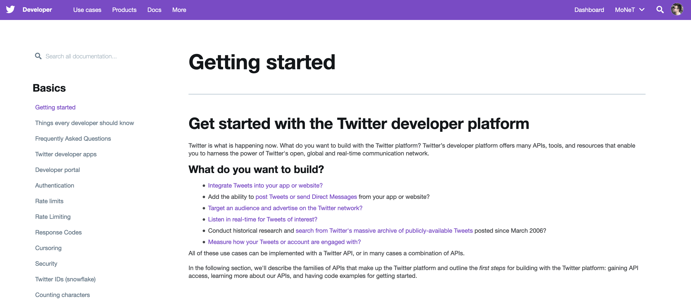

# dataPy: Twitter


##  [Twitter API](https://developer.twitter.com/en/docs.html)

[](https://developer.twitter.com/en/docs.html)

##  Python Packages

###  [Tweepy](https://www.tweepy.org/)

Tweepy is a Python wrapper for making common tasks in the Twitter API accessible and easy to use. It is fully [documented](https://tweepy.readthedocs.io/en/latest/index.html) and it has community support that share [examples](https://stackabuse.com/accessing-the-twitter-api-with-python/) and help.

```bash
source activate DataPy
pip install tweepy
conda deactivate
```

https://developer.twitter.com/en/apps/16139502


### [Other](https://stackabuse.com/accessing-the-twitter-api-with-python/)

* [Tweepy](https://github.com/tweepy/tweepy)
* [Twython](https://github.com/ryanmcgrath/twython)
* [Python-twitter](https://github.com/bear/python-twitter)
* [Python Twitter Tools](https://github.com/bear/python-twitter)
