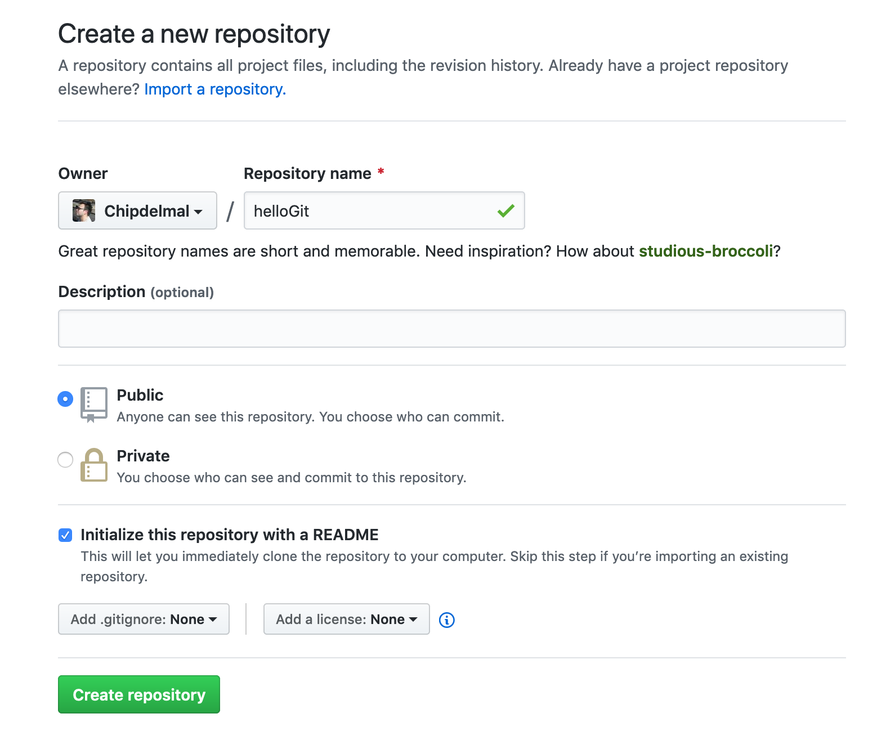
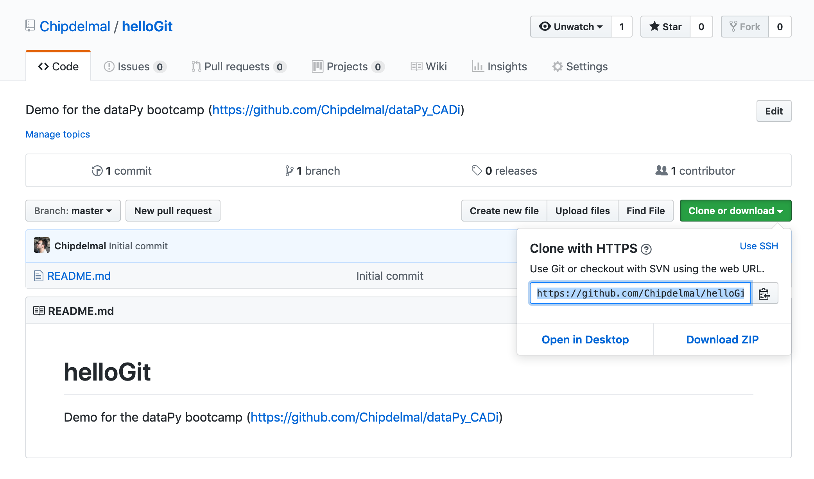

## Creating a git Repo

###  Setup

```bash
git config --global user.name "MY_USERNAME"
git config --global user.email "MY_EMAIL@DOMAIN.COM"
git config --global core.editor "nano -w"
```

### Creating a Github Repo







### Linking to a [Github](https://github.com/) Repo

```bash
git init
git remote add origin https://github.com/Chipdelmal/helloGit.git
git remote -v
git pull origin master
```

### Creating a file

```bash
nano trackMe.py
```

### Staging and Committing

```bash
git status
git add trackMe.py
git status
git commit -m "Created a 'Hello World' file."
git push origin master
```

### Making Changes

```bash
nano trackMe.py
git add *
git commit -m "Repeating the message 8 times."
git push origin master
```

### Ignoring Files and Folders

```bash
nano .gitignore
git add *
git commit -m "Adding gitignore."
git log --oneline --graph --all --decorate
```

### Restoring to a previous state

```bash
git checkout LOG_ID trackMe.py
git commit -m "Reverting to a previous state."
git push origin master
```

<hr>

##  A More Detailed Explanation
